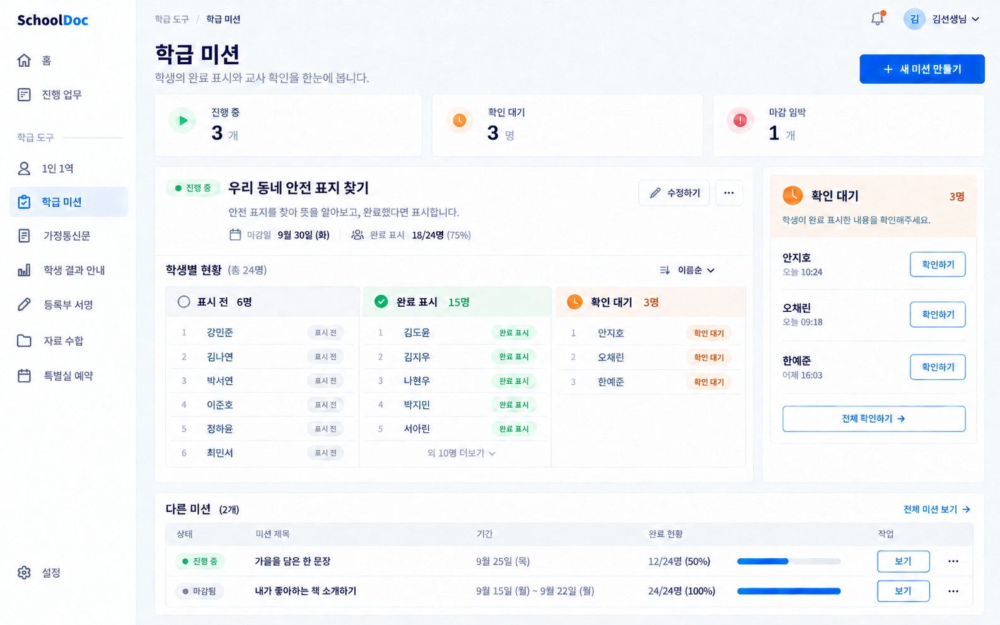
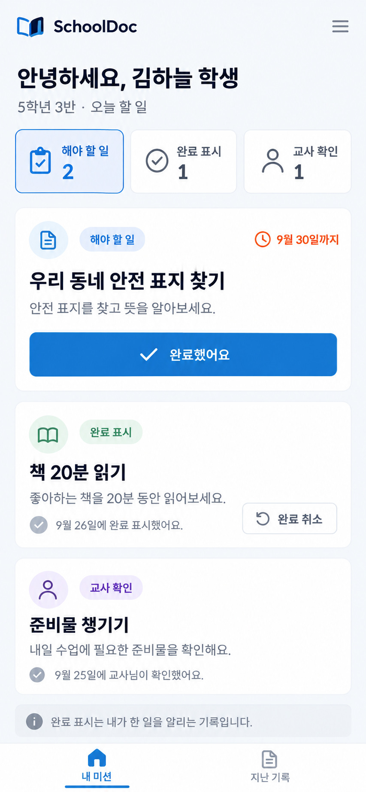

# SchoolDoc ‘학급 미션’ 기획서

2026-09-27 · 조사와 화면 시안 단계 · 구현·배포 전 제안

로컬 개발 결과와 실제 화면 캡처는 [구현·검토 기록](implementation-review.md)에 정리했다.

## 제안 요약

교사가 학급에 **기한이 있는 미션**을 내고, 학생이 자신의 완료 여부를 표시하면, 교사가 **표시 전·완료 표시·확인 대기**를 한 화면에서 보는 도구를 추가한다. 첫 버전은 짧은 체크에 집중한다. 사진·파일 제출, 채점, 보상, 알림장은 기존 도구와 요구가 겹치므로 후속 검증 대상으로 둔다.

핵심 질문은 “학생이 실제로 수행했는가?”가 아니라 **“누가 완료했다고 표시했고, 교사는 누구를 더 확인해야 하는가?”**다. 학생의 표시를 자동으로 교사 확인이나 성취 평가로 바꾸지 않는다.

| 항목 | 권장 결정 |
| --- | --- |
| 도구 이름 | 학급 미션 |
| 교사 진입 | 홈의 학급 도구 카드 → `/tools/class-missions` |
| 학생 진입 | 학급 공통 링크·저장 가능한 QR → 개인 접속 코드 입력 → 자기 미션만 보기 (`/s/missions/:token`) |
| 미션 단위 | 제목, 짧은 안내, 대상 학생, 시작·마감, 교사 확인 필요 여부 |
| 학생 행동 | `완료했어요` 한 번. 교사 확인 전에는 `완료 취소` 가능 |
| 교사 행동 | 미션별 현황 확인, 확인 대기 개별·일괄 확인, 기록 정정, 종료 |
| 보류할 기능 | 사진·파일·영상 제출, 쿠키·뱃지·순위, 푸시, 학생 간 공유, 자동 평가 |

## 무엇을 확인했나

조사 자료는 제품의 방향을 이해하기 위한 근거다. 로그인 뒤의 현재 운영 화면이나 최신 요금·권한은 확인하지 않았다. 2022년 영상과 2023~2025년 가이드는 **당시 기능을 보여주는 자료**이므로 현재 다했니의 모든 기능으로 단정하지 않는다.

| 관찰 | 근거 | SchoolDoc에 주는 시사점 |
| --- | --- | --- |
| 교사는 웹에서 과제를 제시하고 학생은 앱 또는 웹에서 제출한다. 교사가 제공한 코드로 학생을 연결한다. | [개발자 소개 페이지](https://sites.google.com/view/dahandin/kor-%EB%8B%A4%ED%96%88%EB%8B%88-%EB%8B%A4%ED%96%88%EC%96%B4%EC%9A%94), [에듀테크 수업 활용 가이드](https://kr.object.ncloudstorage.com/moe/product-usecase/6900557e36b3e5214e2fb674_2023%20%EC%97%90%EB%93%80%ED%85%8C%ED%81%AC%20%EC%88%98%EC%97%85%20%ED%99%9C%EC%9A%A9%20%EA%B0%80%EC%9D%B4%EB%93%9C%EB%B6%81_%EB%8B%A4%ED%96%88%EB%8B%88.pdf) | 교사용 데스크톱과 학생용 모바일 웹을 분리하고, 학생 회원가입은 요구하지 않는다. |
| 과제 제출, 교사 피드백과 별도 체크리스트가 있다. 영상의 4:10 구간은 과제 생성·제출, 13:27 구간은 체크리스트를 다룬다. | [2022년 사용 설명 영상](https://www.youtube.com/watch?v=VSrVugJ4FGw&t=250s) · [체크리스트 구간](https://www.youtube.com/watch?v=VSrVugJ4FGw&t=807s), [교육부 활용 가이드](https://kr.object.ncloudstorage.com/moe/product-usecase/6900557e36b3e5214e2fb674_2023%20%EC%97%90%EB%93%80%ED%85%8C%ED%81%AC%20%EC%88%98%EC%97%85%20%ED%99%9C%EC%9A%A9%20%EA%B0%80%EC%9D%B4%EB%93%9C%EB%B6%81_%EB%8B%A4%ED%96%88%EB%8B%88.pdf) | 첫 버전의 ‘완료 체크’를 과제 파일 수합과 구분한다. |
| 학생 제출에 대해 교사가 보상·평정·반려·코멘트를 줄 수 있으며, 체크리스트를 일상 확인에 활용한 사례가 있다. | [에듀테크 소프트랩 수업 사례](https://kr.object.ncloudstorage.com/moe/product-usecase/68f1c605d01fd67b8ec9c2c4_2023%20%EC%97%90%EB%93%80%ED%85%8C%ED%81%AC%20%EC%86%8C%ED%94%84%ED%8A%B8%EB%9E%A9%20%EC%9A%B0%EC%88%98%EC%88%98%EC%97%85%EC%82%AC%EB%A1%80%20%EB%B0%8F%20%EC%95%84%EC%9D%B4%EB%94%94%EC%96%B4%20%EB%B0%9C%EA%B5%B4%20%EA%B3%B5%EB%AA%A8%EC%A0%84%20%EC%9A%B0%EC%88%98%EC%82%AC%EB%A1%80%EC%A7%91_%EB%8B%A4%ED%96%88%EB%8B%88.pdf) | 확인과 정정을 먼저 만들고, 평정·보상은 사용성 검증 뒤 결정한다. |
| 교과전담 교사가 많은 학생의 단순 체크리스트를 관리하려는 사례가 있다. | [교과전담 교사 사용 사례](https://chae-ssaem.tistory.com/entry/%EB%8B%A4%ED%96%88%EB%8B%88-200%EB%AA%85-%ED%95%99%EC%83%9D%EB%93%A4%EC%9D%98-%EA%B3%BC%EC%A0%9C-%EA%B4%80%EB%A6%AC%ED%95%98%EA%B8%B0-1%EB%8B%A4%ED%96%88%EB%8B%88-%EC%A4%80%EB%B9%84%ED%95%98%EA%B8%B0?category=592964) | 한 학급 24명뿐 아니라 여러 반·긴 명단에서도 검색과 대상 필터가 필요하다. |

유튜브 영상은 다시 열어 실제 재생을 확인했고, 위 두 챕터의 화면을 표본으로 살펴봤다. 전체 19분 영상을 모두 검수한 결과로 표현하지 않는다.

## SchoolDoc에서 맡을 자리

| 기존 도구 | 이미 해결하는 문제 | 학급 미션과의 경계 |
| --- | --- | --- |
| 1인 1역 | 정해진 역할을 날짜마다 `했어요/못했어요`로 기록 | 역할·요일·배정 기간을 갖는 반복 활동은 그대로 1인 1역에 둔다. 학급 미션은 임의의 과제와 마감이 중심이다. |
| 자료 수합 | 파일이나 응답을 받아 내용·제출 현황을 관리 | 결과물 자체가 필요하면 자료 수합으로 안내한다. 학급 미션은 완료 여부를 빠르게 표시한다. |
| 학생 결과 안내 | 학생별 결과를 개인적으로 안내하고 이의·답변을 관리 | 점수나 민감한 평가를 학급 미션 상태에 넣지 않는다. |
| 진행 업무 | 열려 있는 업무를 모아 보여 줌 | 미션의 열림·마감 상태와 진행률을 여기에도 노출한다. |

1인 1역의 학급 명단 입력·Excel 해석 규칙은 재사용 후보지만, 해당 기능의 명단은 현재 그 도구의 보드에 속한다. 첫 버전은 **교사 소유권을 검증한 가져오기 또는 파일·붙여넣기**로 미션용 명단을 만들고, 미션 발행 시 대상을 스냅샷으로 남긴다. 다른 도구의 보드 저장 형식에 직접 결합하거나 명단 수정을 과거 미션에 소급하지 않는다.

## 대표 사용 흐름

### 교사: 미션 만들기

1. `새 미션 만들기`에서 제목·한 문장 안내·대상 학급/학생·시작일·마감일을 입력한다.
2. `교사 확인 필요`를 켜거나 끈다. 기본값은 **끔**이다. 실물 검사나 수업 중 확인이 필요한 경우에만 켠다.
3. 발행 전 대상 인원과 학생에게 보일 내용을 미리 본다.
4. 발행 후 학급 링크와 QR 이미지를 내려받아 공유한다. QR이 화면에 있으면 반드시 PNG 저장을 제공한다.
5. 현황에서 `표시 전`, `완료 표시`, `확인 대기`, `교사 확인`을 본다. 확인이 필요한 미션은 대기 명단에서 처리한다.

### 학생: 완료 표시

1. 학급 링크·QR을 열고 교사가 나눠준 **개인 접속 코드**를 입력한다. 회원가입은 없다.
2. 자기에게 열린 미션만 확인하고 `완료했어요`를 누른다.
3. 서버 저장 성공 후 상태와 시간을 확인한다. 네트워크 오류면 버튼을 다시 누를 수 있고 중복 기록이 생기지 않는다.
4. 교사가 확인하기 전에는 실수한 표시를 취소할 수 있다. 교사 확인 후 수정이 필요하면 교사가 다시 열어 준다.

공용 태블릿은 제출 후 `나가기`로 개인 세션을 지우고 코드 입력 화면으로 돌아간다. 학생 화면에는 반 전체 명단·다른 학생 상태·교사 전용 메모를 내려주지 않는다.

## 상태와 수치의 뜻

| 학생별 상태 | 발생 조건 | 학생 화면 | 교사 화면 |
| --- | --- | --- | --- |
| 표시 전 | 아직 완료 표시 없음 | `해야 할 일` | `표시 전` |
| 완료 표시 | 학생이 완료를 알림, 교사 확인을 요구하지 않음 | `완료 표시` | `완료 표시` |
| 확인 대기 | 학생이 완료를 알림, 교사 확인을 요구함 | `확인 기다리는 중` | `확인 대기` |
| 교사 확인 | 교사가 확인함 | `교사 확인` | `교사 확인` |
| 해당 없음 | 교사가 대상에서 제외하거나 불참 처리 | 기본 목록에서 숨기고 별도 표시 | 별도 필터와 사유 없는 이력 |

- **완료 표시 수 = 완료 표시 + 확인 대기 + 교사 확인**이다. `표시 전`을 실제 미수행으로 단정하지 않는다.
- 분모는 그 미션의 대상 학생 수다. 발행 후 명단이 바뀌어도 당시 대상과 기록의 의미는 유지한다. `해당 없음`은 별도로 집계하고 완료율 분모에서 뺀다.
- 미션 자체는 `초안 → 진행 중 → 종료`로 이동한다. 마감 시각이 지난 진행 중 미션은 `마감 지남`을 붙이고 학생의 새 완료 표시는 막는다. 교사는 마감 연장·재열기를 선택할 수 있다.
- 학생의 취소나 교사 정정은 최종 상태와 별개로 최소한의 변경 이력을 남긴다. 두 탭에서 동시에 바꾸면 버전 충돌을 알려주고 최신 상태를 다시 보여준다.

## 첫 버전 요구사항

| 우선순위 | 요구사항 | 완료 기준 |
| --- | --- | --- |
| P0 | 교사 명단 등록·가져오기 | 번호·동명이인 구분, 중복·최대 인원 검사, 가상 명단으로 확인 |
| P0 | 미션 생성·발행·수정·종료 | 대상·마감·확인 여부를 발행 전에 확인. 수정이 과거 대상·기록을 조용히 바꾸지 않음 |
| P0 | 학생 개인 접속 | 코드 검증은 서버에서 수행. 다른 학생의 미션·상태·명단을 응답에 포함하지 않음 |
| P0 | 완료 표시·취소·교사 확인 | 중복 요청에도 상태 1건 유지, 저장 실패 복구, 교사 확인 전 취소 가능 |
| P0 | 교사용 현황 | 대상 0명·24명·최대 명단·긴 이름에서 상태와 대기자 수가 정확함 |
| P0 | 링크·QR 공유 | 링크 복사와 QR PNG 저장, 공개 링크 끄기·재발급 |
| P1 | 진행 업무 연결·Excel 내보내기 | 열려 있는 미션만 집계, 다운로드에 상태 의미와 기준일 표시 |
| P1 | 미션 복제·일괄 확인 | 발행 전 대상 재확인, 일괄 작업은 대상·수량을 먼저 보여 줌 |
| P2 | 사진·텍스트 증빙, 개별 코멘트, 알림 | 자료 수합과의 역할·개인정보 보관 범위를 다시 정한 뒤 개발 |

## 대표 화면 시안

### 교사: 미션 현황

주 작업은 선택된 미션의 **표시 전 6명·완료 표시 15명·확인 대기 3명** 파악과 확인 대기 처리다. 24명 중 18명이 완료를 표시한 예시다. 오른쪽 대기 명단과 가운데 명단의 가상 이름을 맞췄다. 화면 아래에 다른 미션 두 건을 배치해 전환할 수 있다.

### 학생: 내 미션

학생 화면은 자기 미션과 `완료했어요`에 집중한다. 시안은 한 화면에 첫 미션을 강조하고, 완료 표시·교사 확인의 차이를 함께 보여준다. 전체 세로 화면을 생성한 **정적 콘셉트 이미지**이며 실제 동작·접근성 검증 결과가 아니다. 시안의 가상 인원·날짜·이름은 구현 데이터나 운영 자료가 아니다.

시안과 구현의 관계: 시안의 학생 화면은 코드 입력을 마친 뒤의 상태이며, 교사 화면은 `교사 확인 필요`가 켜진 한 미션을 선택한 상태다. 구현 때 현재 SchoolDoc 공통 사이드바·테마 설정과 정확히 맞추고, 각 상태의 용어를 이 기획서 기준으로 정리한다.

## 구현 구조 제안

| 영역 | 경로·구성 | 책임 |
| --- | --- | --- |
| 교사 UI | `src/features/classMissions/`, `/tools/class-missions` | 생성·대상 선택·현황·확인·내보내기 |
| 학생 UI | `/s/missions/:token` | 코드 진입·자기 미션·완료/취소 |
| 서버 | `supabase/functions/class-missions/`, 기존 `_shared/` 규칙 검토 | 공개 토큰·개인 코드·기간·권한·중복 요청 검증 |
| DB | 새 `supabase/migrations/` 파일 | 교사 소유 보드, 암호화 명단, 미션, 대상 스냅샷, 상태, 변경 이력 |
| 홈·업무 | `src/App.tsx`, `src/features/activeWork/` | 도구 카드와 진행 업무 제공 |

새 모듈의 교사 API는 로그인 사용자와 보드 소유자 검사, RLS를 모두 거친다. 학생 API는 긴 난수 공개 토큰과 개인 코드의 해시·요청 제한을 검증하고 **해당 학생의 응답만** 돌려준다. 코드는 로그·URL·분석 도구에 남기지 않는다. 이름과 연결 정보는 기존 서버 암호화 경로를 참고해 저장하며 키가 없으면 기능을 중단한다. 개발 데모는 가상 자료만 로컬 저장하고 실제 API 권한을 대신하지 않는다.

마이그레이션 번호 중복을 다른 브랜치·워크트리와 먼저 확인한다. 실제 배포가 정해지면 secrets → DB → 지정 Edge Function → 프런트엔드 순으로 적용하고 운영 주소에서 권한·제출·확인을 따로 검증한다. 이 문서 작업에서는 원격 변경을 하지 않았다.

## 개인정보·운영 결정

- 학생별 코드는 교사가 개별 전달한다. 공통 QR만으로는 개인 정보가 열리지 않는다. 교사는 분실한 코드만 재발급할 수 있고 이전 코드는 즉시 무효화한다.
- 공개 화면에 학급 전체 학생 이름·진행률·순위·개별 피드백을 표시하지 않는다. 교실 화면을 공유할 때는 이름 가림 보기를 제공하는 방향으로 설계한다.
- 첫 버전에는 파일 원본을 저장하지 않는다. 종료 후 **90일**이 지나면 환경 설정의 파기 예정 목록에 표시하고, 교사가 미션 화면에서 대상·수량을 확인하고 명시적으로 동의한 미션만 영구 파기한다. 진행 중인 미션은 파기 대상이 아니다. 마지막 미션을 파기하면 학급 명단·개인 코드를 비우고 학생 링크를 중지한다. 실패한 항목은 개인정보 없는 재시도 기록으로 남긴다. 이 기본값은 기존 도구에 소급하지 않는다.
- 마감 후에도 교사용 기록 열람과 정정은 권한 있는 교사만 할 수 있다. Excel에는 `완료 표시`와 `교사 확인`을 별도 열로 출력해 자기보고를 검증된 수행으로 오해하지 않게 한다.

## 개발 순서와 검증

1. **도메인·권한:** 미션/대상/상태의 공유 규칙, 개인 코드, 소유자·RLS, 서버 기간 검증을 구현한다.
2. **교사·학생 흐름:** 명단 가져오기 → 생성/발행 → 완료/취소 → 현황/확인 → 종료, 개발 데모를 만든다.
3. **연결:** 홈 도구 카드, 진행 업무, QR PNG 저장, 필요 시 Excel을 추가한다.
4. **검증:** 타입 검사 `npm run typecheck`, 린트 `npm run lint`, 관련 단위·서버 권한 테스트, 데모 E2E의 데스크톱/390px 모바일·200% 확대, `npm run build`를 수행한다. 새 관리 화면은 `tests/e2e/app-shell-scroll.spec.ts`에 포함한다.
5. **운영 전 확인:** 교사 A/B 격리, 타 학생 코드 사용·코드 추측 제한, 마감 경계, 중복 제출, QR 저장, 빈 명단·오류 복구, 24명·최대 인원 가상 명단, 실제 원격 동작을 각각 확인한다. 데모 통과를 원격 검증으로 보고하지 않는다.

성공 기준은 **교사 2분 내 첫 미션 발행**, 개인 코드 진입 뒤 **학생 20초 내 완료 표시**, 24명 현황에서 **확인 대기자를 한눈에 찾기**, 한 명의 재전송·중복 클릭에도 **기록 한 건 유지**, 권한 없는 접근에서 **다른 학생 정보 0건 노출**이다. 시간 목표는 가설이며 실제 교사·학생 시험으로 검증해야 한다.

## 세 관점 모의 검토

`pro/web-designer.md`, `pro/ux-designer.md`, `pro/ui-designer.md`를 제작 전에 읽고 정적 시안을 검토했다. 아래는 AI의 모의 판단이며 실제 전문가·교사 인터뷰나 사용성 시험이 아니다.

| 관점 | 제작 전 판단·근거 | 제작 후 판단·근거 | 남은 위험 |
| --- | --- | --- | --- |
| 웹디자인 | **수정 필요.** 24명을 한 줄 목록으로만 두면 대기자 파악이 늦다. | **판단 보류.** 교사 전체 이미지에서 6/15/3명 그룹과 대기 패널의 열 균형을 확인했다. 학생 전체 이미지에는 세 상태가 함께 보인다. | 실제 0명·60명, 긴 이름, 200% 확대의 화면 균형은 구현 후 전체 캡처가 필요하다. |
| UX | **수정 필요.** 학생 자기보고와 교사 확인을 같은 ‘완료’로 합치면 오해한다. | **판단 보류.** `완료했어요` → `확인 대기` → `교사 확인`의 위치와 문구를 시안에서 구분했다. | 정적 이미지에서는 취소·저장 실패·공용 태블릿 나가기의 클릭 흐름을 시험할 수 없다. |
| UI | **수정 필요.** 색만으로 세 상태를 표현하면 구분이 약하다. | **판단 보류.** 텍스트 상태·아이콘·버튼을 함께 표시하고, 주요 모바일 행동을 크게 배치했다. | 실제 44×44px 터치 영역, 포커스, 키보드·스크린리더, 대비는 구현 후 검사해야 한다. |

기획서·이미지 작업만 했으므로 타입 검사·단위/E2E·빌드·배포는 실행 대상이 아니다. 기존 변경 파일은 수정하지 않았다. 외부 개발 일지 `../schooldoc-docs/development-history.md`는 이 checkout에서 찾지 못해 기록하지 않았다.

[이미지 생성 프롬프트와 수정 기록](prompts.md)
