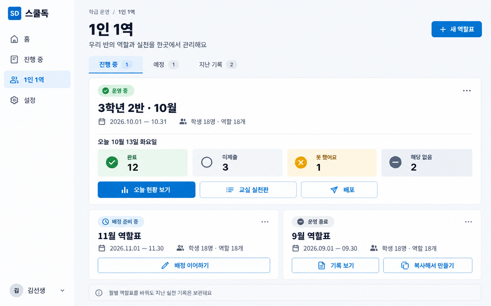
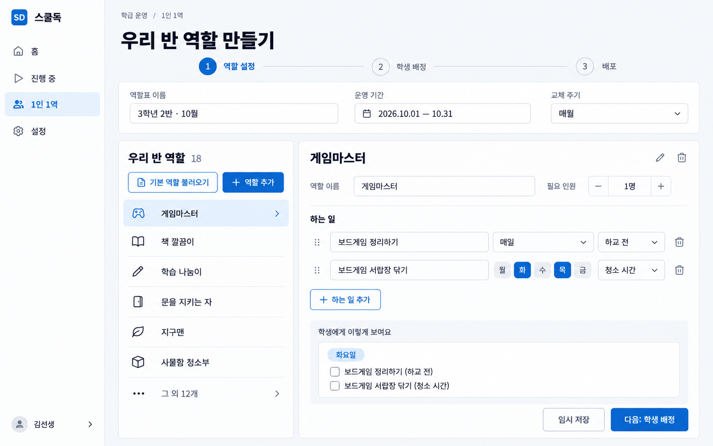
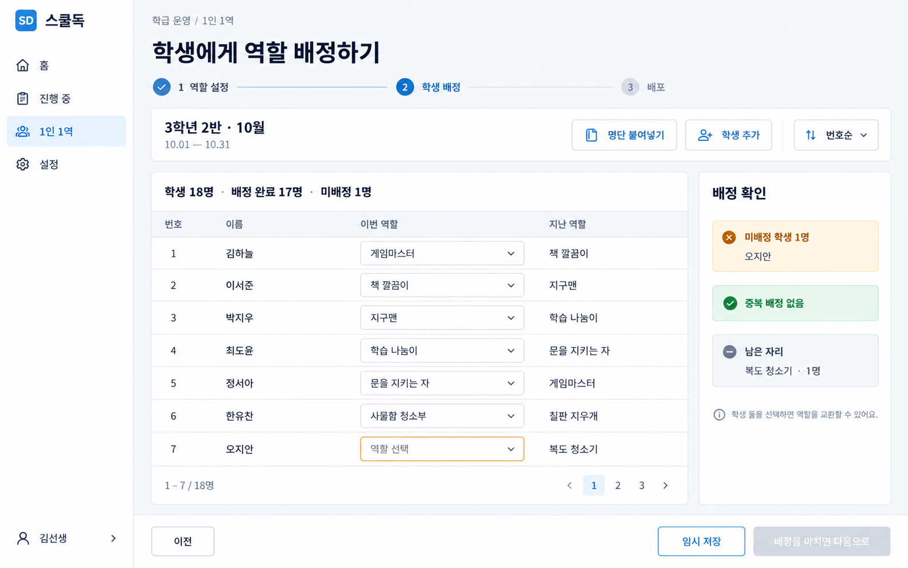
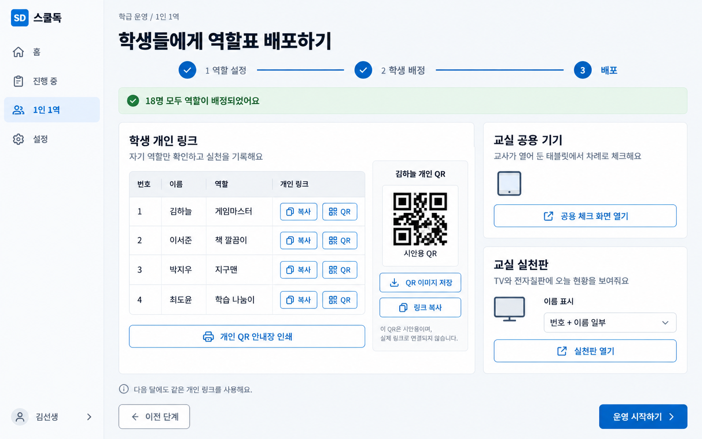
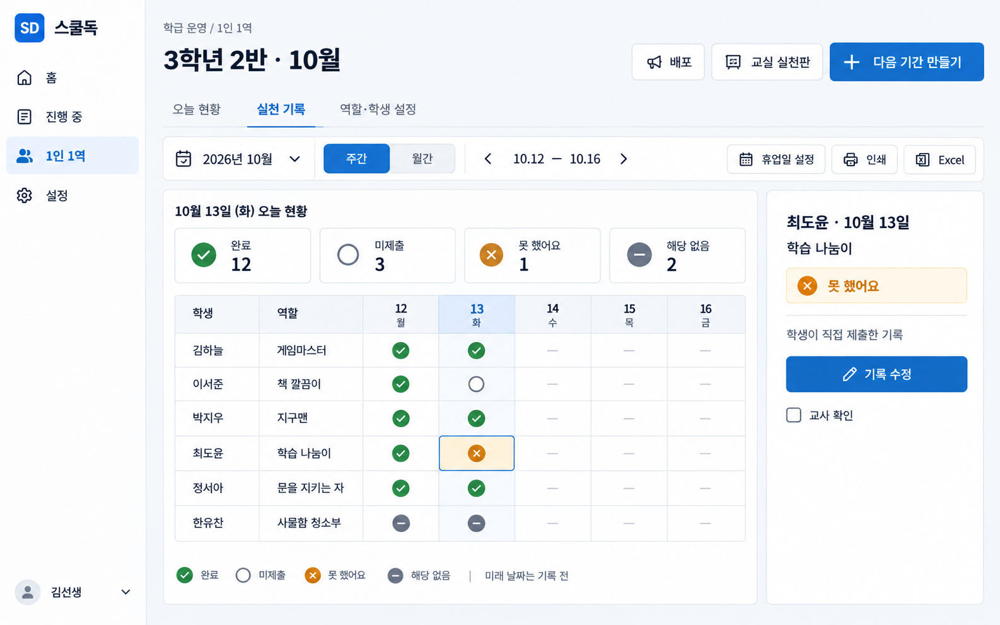
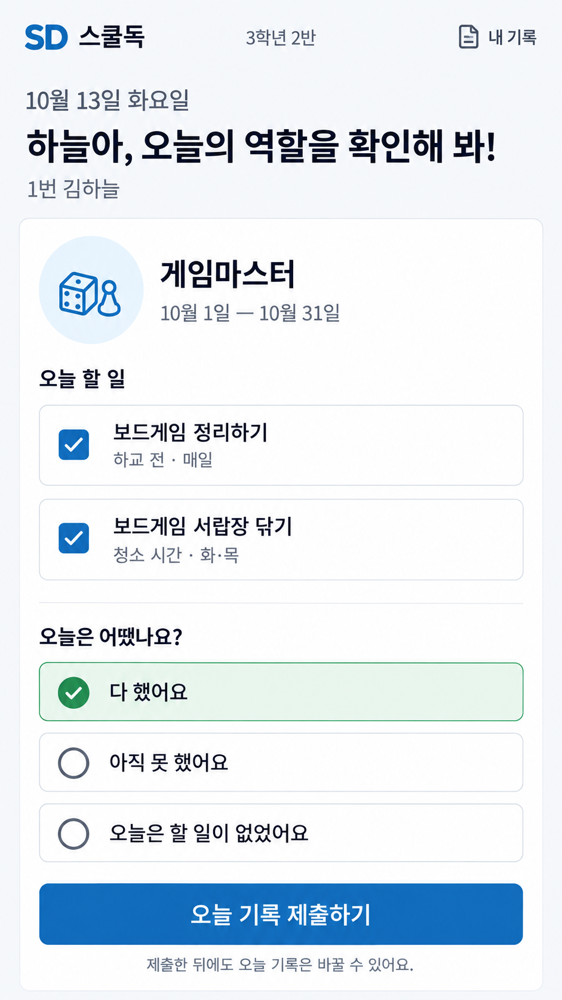
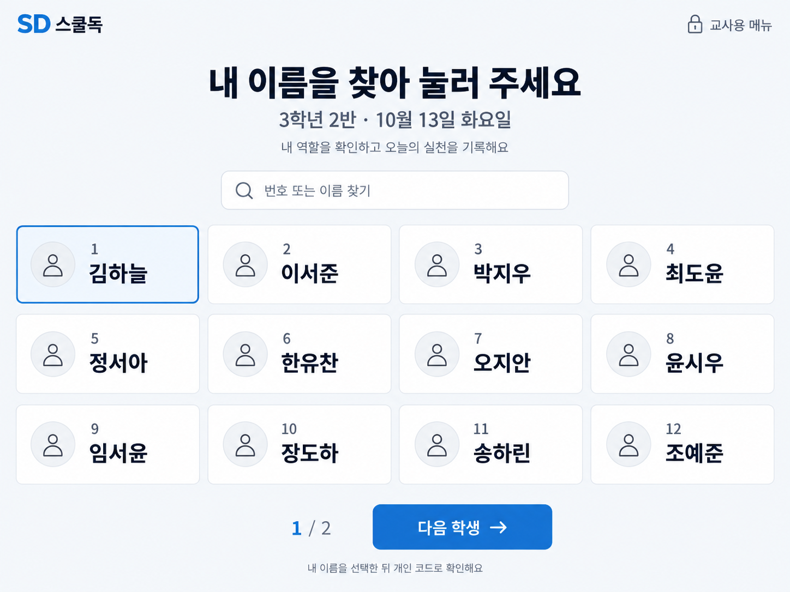
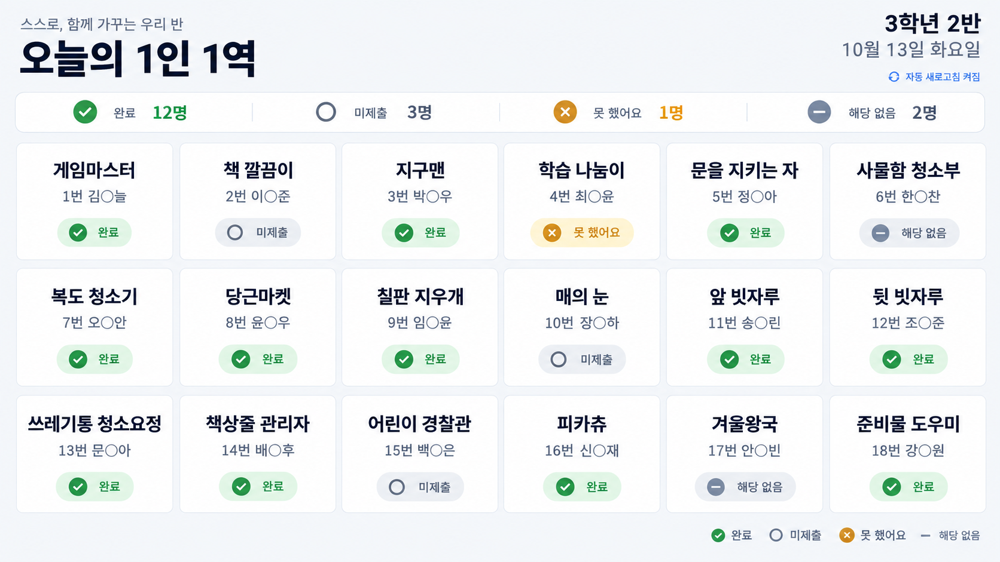
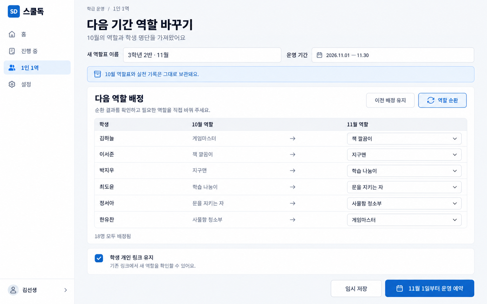

# 1인 1역 — 페이지별 이미지 시안

2026-09-26 · SchoolDoc · v1 · 총 9장

내장 image_gen으로 제작한 디자인 검토용 이미지입니다. 실제 앱 기능을 구현하거나 배포한 결과는 아닙니다. 학생 이름·기록은 모두 가상 예시이며 QR도 시안용입니다.

기존 SchoolDoc의 파란색 계열과 교사용 탐색 구조를 바탕으로, 학생용 화면에는 큰 글씨와 버튼을 적용했습니다. 원본 PNG를 누르면 개별 시안을 확인할 수 있습니다.

| 번호 | 페이지 | 확인할 내용 |
| --- | --- | --- |
| 01 | [교사용 운영 목록](01-teacher-overview.png) | 월별 역할표와 오늘의 제출 현황을 확인하고, 새 역할표·실천판·배포로 이동합니다. |
| 02 | [역할과 하는 일 설정](02-role-settings.png) | 역할을 추가·삭제하고 하는 일마다 매일·특정 요일·수행 시점을 지정합니다. |
| 03 | [학생 명단과 역할 배정](03-student-assignment.png) | 학생별 역할을 배정하고 지난 역할, 미배정 학생, 남은 자리를 확인합니다. |
| 04 | [링크와 QR 배포](04-share-distribute.png) | 개인 링크·QR, 공용 기기, 교실 실천판을 배포하며 QR 이미지 저장을 제공합니다. |
| 05 | [교사용 실천 기록표](05-teacher-records.png) | 주간·월간 기록에서 네 가지 상태를 구분하고 교사가 기록을 확인·수정합니다. |
| 06 | [학생 개인 실천 체크](06-student-mobile.png) | 학생이 오늘 할 일을 확인하고 역할 전체의 실천 여부를 제출하는 모바일 화면입니다. |
| 07 | [교실 공용 기기 체크](07-classroom-kiosk.png) | 교사가 연 공용 기기에서 학생이 본인을 선택하고 개인 확인 후 체크하는 시작 화면입니다. |
| 08 | [교실 TV·전자칠판 실천판](08-classroom-board.png) | 교실 TV·전자칠판용으로 역할·담당 학생·오늘 상태를 한눈에 보여줍니다. |
| 09 | [다음 기간 역할 교체](09-next-period.png) | 기존 기록과 학생 개인 링크를 유지하면서 다음 기간의 역할을 배정하고 예약합니다. |

## 설계 시 확인한 구분

- 역할 배정 기간과 각 업무의 수행 요일은 별도 설정입니다.
- 완료·미제출·못 했어요·해당 없음의 의미를 구분합니다.
- 교사용 기록표와 교실 공개 실천판은 표시 정보를 다르게 구성합니다.
- 다음 기간으로 바꿔도 지난 기록과 학생 개인 링크는 유지하는 구상입니다.
- 생성 이미지의 세부 글자·간격·샘플 표시는 구현 시 확정할 디자인 참고이며 실행되는 컨트롤은 아닙니다.

[전체 최초 프롬프트](prompts.md) · [배경·문구 보정 프롬프트](refinement-prompts.md)

## 01. 교사용 운영 목록

월별 역할표와 오늘의 제출 현황을 확인하고, 새 역할표·실천판·배포로 이동합니다.

## 02. 역할과 하는 일 설정

역할을 추가·삭제하고 하는 일마다 매일·특정 요일·수행 시점을 지정합니다.

## 03. 학생 명단과 역할 배정

학생별 역할을 배정하고 지난 역할, 미배정 학생, 남은 자리를 확인합니다.

## 04. 링크와 QR 배포

개인 링크·QR, 공용 기기, 교실 실천판을 배포하며 QR 이미지 저장을 제공합니다.

## 05. 교사용 실천 기록표

주간·월간 기록에서 네 가지 상태를 구분하고 교사가 기록을 확인·수정합니다.

## 06. 학생 개인 실천 체크

학생이 오늘 할 일을 확인하고 역할 전체의 실천 여부를 제출하는 모바일 화면입니다.

## 07. 교실 공용 기기 체크

교사가 연 공용 기기에서 학생이 본인을 선택하고 개인 확인 후 체크하는 시작 화면입니다.

## 08. 교실 TV·전자칠판 실천판

교실 TV·전자칠판용으로 역할·담당 학생·오늘 상태를 한눈에 보여줍니다.

## 09. 다음 기간 역할 교체

기존 기록과 학생 개인 링크를 유지하면서 다음 기간의 역할을 배정하고 예약합니다.

## 검토 기록

- 9개 페이지의 구성, 주요 한글 문구와 상태 표현을 시각적으로 확인했습니다. PNG 9개를 디코딩 검증하고 문서의 로컬 링크 20개가 실제 파일로 연결되는지 확인했습니다.
- 역할 설정 시안의 배경 표시 문제와 일부 탐색 문구는 이미지 생성 도구로 보정 후 재생성했습니다.
- 앱 소스는 수정하지 않았으므로 타입 검사·단위 테스트·E2E·배포는 실행하지 않았습니다.
- 별도 UX 지침 및 외부 개발 일지는 이 checkout에서 확인되지 않아 이번 대화와 저장소 문서를 기준으로 작성했습니다.
