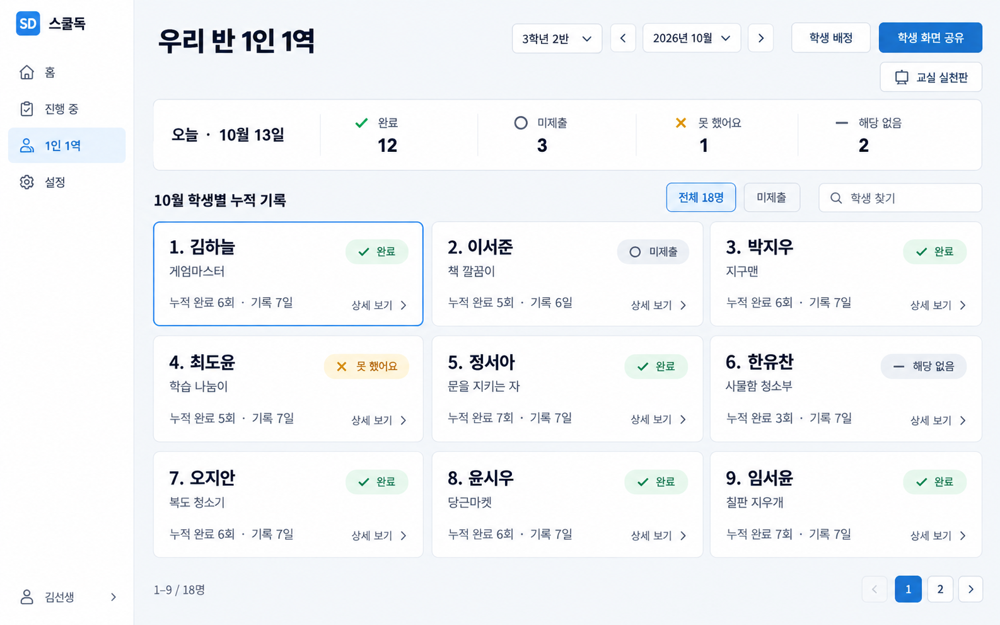
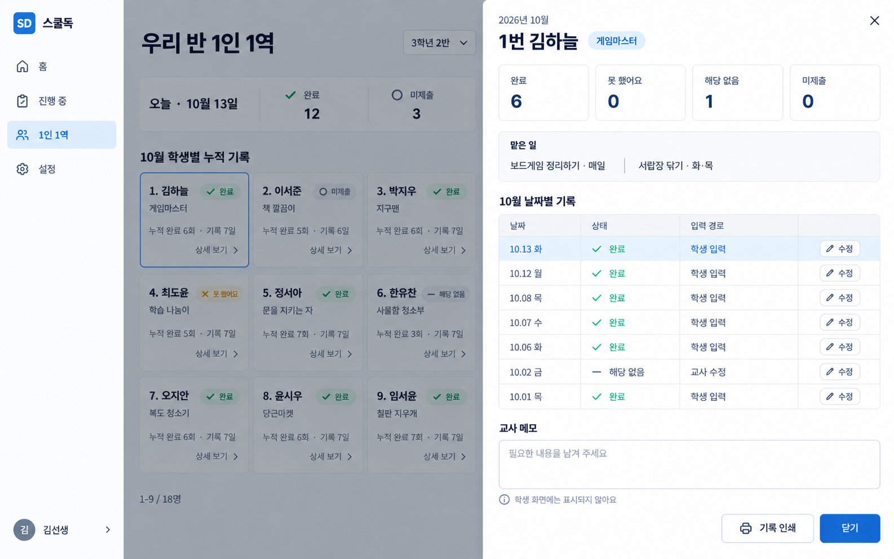
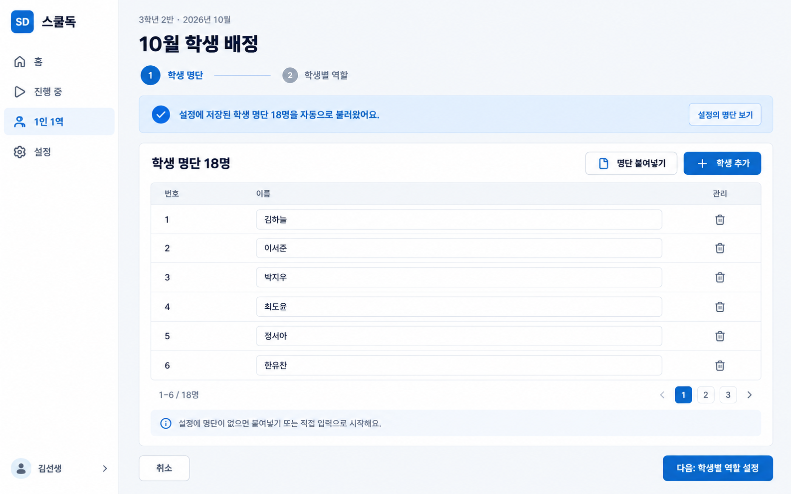
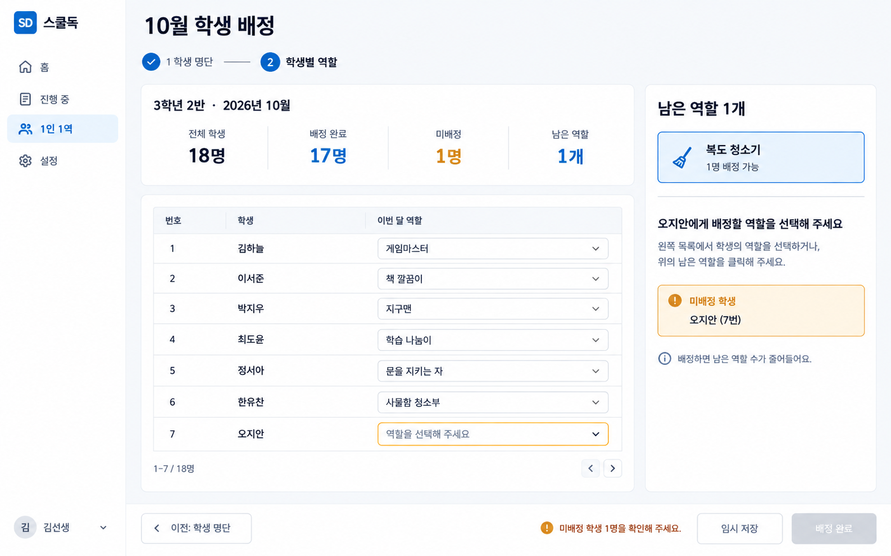
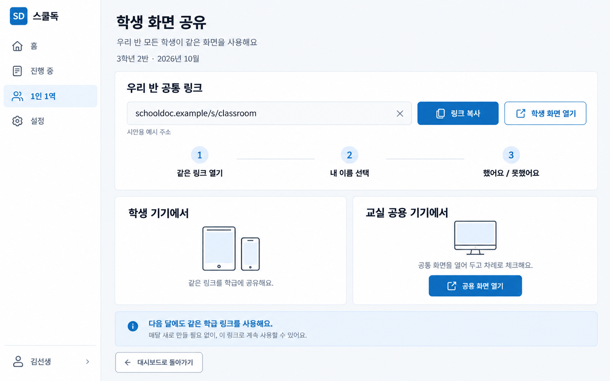
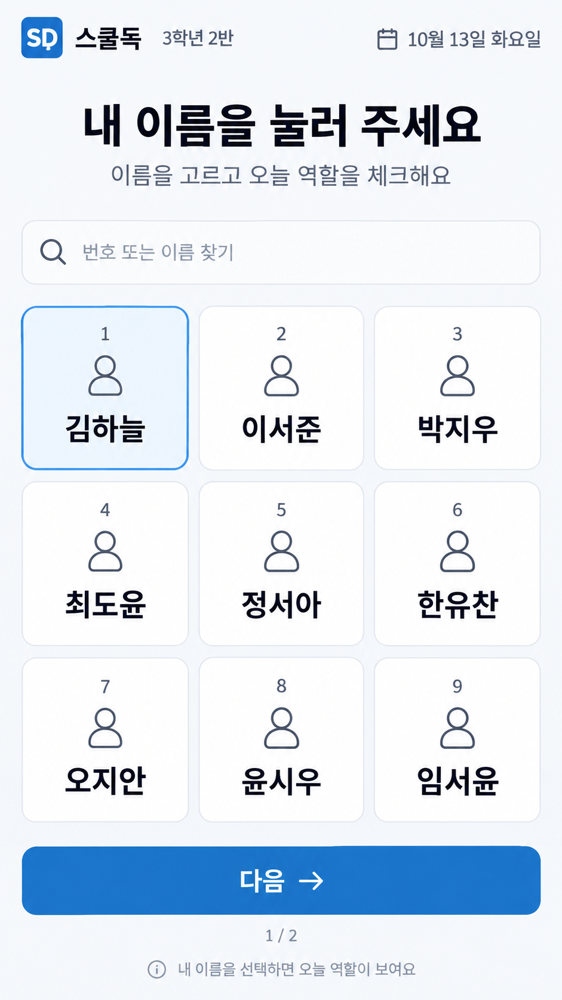
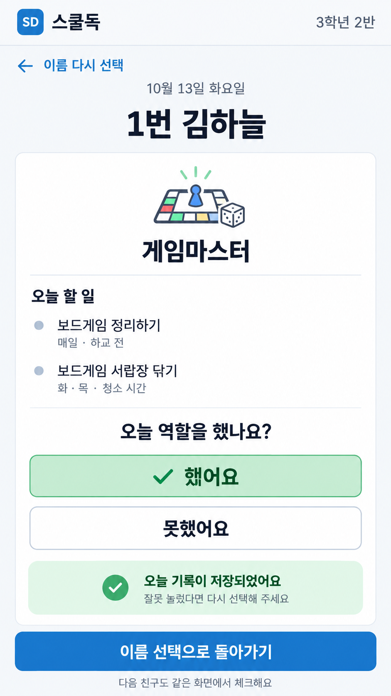

# 1인 1역 — 수정 시안 v2

2026-09-26 · 사용자 피드백 반영 · 7개 화면

이번 시안은 모든 학생이 같은 화면에서 이름을 선택해 체크하는 방식입니다. 내장 image_gen으로 생성했으며 모든 이름·기록·주소는 가상 예시입니다. 실제 앱 구현이나 배포 결과는 아닙니다.

## 반영한 사항

1. **공통 학생 화면:** 학급 링크 한 개를 모든 학생에게 공유합니다. 학생별 링크·QR·개인 코드·로그인을 요구하지 않습니다. 학생이 이름을 선택하고 역할을 했는지 누르면 저장합니다.
2. **한 달에 집중하는 교사 화면:** 월 선택기로 조회 월을 정합니다. 선택한 달의 학생별 타일을 데스크톱에서 3×3으로 보여주고, 타일을 누르면 그 학생의 해당 월 누적 기록과 날짜별 상세가 펼쳐집니다.
3. **역할 만들기는 추가 논의:** 복잡한 역할 생성 마법사는 이번 수정안에서 확정하지 않습니다. 배정 시안에 보이는 역할 목록은 예시입니다.
4. **배정은 두 단계:** 1단계 학생 명단, 2단계 학생별 역할 설정입니다. 공유 화면은 배정 이후 대시보드에서 여는 기능이며 3단계로 추가하지 않습니다.

## 화면 모음

| 번호 | 페이지 | 핵심 |
| --- | --- | --- |
| 01 | [선택한 달의 학생별 대시보드](01-monthly-student-dashboard.png) | 선택한 달만 표시하며 학생별 타일을 3×3으로 배치합니다. 각 타일에서 역할, 오늘 상태, 해당 월 누적 기록을 확인하고 상세 기록을 엽니다. |
| 02 | [타일을 눌렀을 때의 학생 상세 기록](02-student-record-detail.png) | 김하늘 타일을 누르면 10월의 누적 횟수와 날짜별 기록이 펼쳐집니다. 학생 입력과 교사 수정 경로를 구분해 표시합니다. |
| 03 | [1단계 · 학생 명단 받기](03-step1-student-roster.png) | 설정에 저장된 명단이 있으면 처음부터 자동으로 채워집니다. 명단이 없으면 붙여넣기나 직접 입력으로 시작합니다. |
| 04 | [2단계 · 학생별 역할 설정](04-step2-role-assignment.png) | 학생마다 역할을 정하면서 미배정 학생 수와 남은 역할 수를 함께 확인합니다. 역할 생성 방식은 별도 논의 대상으로 둡니다. |
| 05 | [모든 학생에게 같은 화면 배포](05-shared-student-link.png) | 학급 공통 링크 한 개를 공유합니다. 학생별 링크·QR·개인 코드 발급은 제거하고, 이름 선택 → 수행 여부 체크 흐름을 안내합니다. |
| 06 | [학생 공통 화면 · 이름 선택](06-shared-name-selection.png) | 모든 학생에게 같은 화면이 열립니다. 번호나 이름으로 자신을 선택하며 개인 QR·로그인·코드 입력이 없습니다. |
| 07 | [학생 공통 화면 · 역할 체크](07-shared-role-check.png) | 이름을 선택한 다음 자신의 역할을 보고 ‘했어요/못했어요’를 누르면 저장됩니다. 별도 제출 단계 없이 이름 선택 화면으로 돌아갑니다. |

## 운영 흐름

- 교사: 월 선택 → 학생 배정 → **1단계 학생 명단** → **2단계 학생별 역할** → 배정 완료 → 대시보드에서 공통 화면 공유.
- 학생: 같은 링크 열기 → 이름 선택 → 오늘 역할 확인 → **했어요 / 못했어요** 누르기 → 저장 확인 → 이름 선택으로 복귀.
- 교사 기록 확인: 선택한 달의 학생 타일 → 해당 학생의 날짜별 기록 → 필요한 경우 수정·메모.

## 두 단계의 동작 기준

### 1단계 학생 명단

- 설정에 명단이 저장되어 있으면 첫 진입부터 해당 명단으로 채웁니다. 별도 불러오기 클릭을 요구하지 않습니다.
- 설정에 명단이 없으면 붙여넣기·직접 입력·학생 추가로 시작합니다.
- 명단을 확인·수정한 뒤 다음 단계로 이동합니다. 이 화면에는 역할 설정을 섞지 않습니다.
- 현재 코드의 `TeacherProfileSettings`에는 학교·교사명·학년반만 있고 공통 학생 명단 저장 항목은 없습니다. 자동 채움은 구현 시 설정의 명단 저장 기능과 함께 연결해야 할 요구사항입니다.

### 2단계 학생별 역할

- 학생마다 이번 달 역할을 정합니다.
- 전체 학생·배정 완료·미배정 학생·남은 역할 수를 동시에 표시합니다.
- 배정·해제·변경할 때 남은 역할 수를 갱신합니다. 예시 화면은 학생 18명·역할 18개, 각 역할 1명 기준입니다.
- 여러 명이 같은 역할을 맡는 기능을 채택하면 역할 종류 수와 남은 배정 인원을 구분해야 합니다. 이 부분은 역할 만들기 방식과 함께 결정합니다.
- 예시에서는 미배정 학생이 남으면 임시 저장은 가능하고 배정 완료는 비활성화됩니다.

## 누적 기록의 의미

- 학생 타일의 누적 기록은 선택한 달의 기록입니다. 다른 달의 합계를 섞지 않습니다.
- 학생이 체크하지 않은 미제출과 직접 못 했다고 기록한 상태를 구분합니다.
- 학생의 기본 화면은 두 가지 선택으로 간단하게 합니다. 결석·휴업·해당 없음은 교사의 날짜/기록 관리에서 처리하는 구상입니다.
- 상세의 입력 경로는 학생 화면 입력인지 교사 수정인지 나타내며, 이름 선택만으로 본인 인증이 됐다고 표시하지 않습니다.
- 교사 메모와 학생별 누적 이력은 공통 학생 화면에 노출하지 않습니다.

## 추가로 논의할 역할 만들기

아직 확정하지 않은 항목입니다. 이번 시안은 기존 예시 역할 목록으로 배정 흐름을 보여줍니다.

- 기본 역할을 골라 이름·설명만 수정할지, 역할 이름을 직접 입력·붙여넣기할지.
- 처음에는 역할 이름과 간단한 하는 일만 받고, 요일·세부 업무는 선택 설정으로 둘지.
- 한 역할에 여러 학생을 배정할지와 남은 인원 표시 방식.

[전체 생성 프롬프트](prompts.md)

## 01. 선택한 달의 학생별 대시보드

선택한 달만 표시하며 학생별 타일을 3×3으로 배치합니다. 각 타일에서 역할, 오늘 상태, 해당 월 누적 기록을 확인하고 상세 기록을 엽니다.

## 02. 타일을 눌렀을 때의 학생 상세 기록

김하늘 타일을 누르면 10월의 누적 횟수와 날짜별 기록이 펼쳐집니다. 학생 입력과 교사 수정 경로를 구분해 표시합니다.

## 03. 1단계 · 학생 명단 받기

설정에 저장된 명단이 있으면 처음부터 자동으로 채워집니다. 명단이 없으면 붙여넣기나 직접 입력으로 시작합니다.

## 04. 2단계 · 학생별 역할 설정

학생마다 역할을 정하면서 미배정 학생 수와 남은 역할 수를 함께 확인합니다. 역할 생성 방식은 별도 논의 대상으로 둡니다.

## 05. 모든 학생에게 같은 화면 배포

학급 공통 링크 한 개를 공유합니다. 학생별 링크·QR·개인 코드 발급은 제거하고, 이름 선택 → 수행 여부 체크 흐름을 안내합니다.

## 06. 학생 공통 화면 · 이름 선택

모든 학생에게 같은 화면이 열립니다. 번호나 이름으로 자신을 선택하며 개인 QR·로그인·코드 입력이 없습니다.

## 07. 학생 공통 화면 · 역할 체크

이름을 선택한 다음 자신의 역할을 보고 ‘했어요/못했어요’를 누르면 저장됩니다. 별도 제출 단계 없이 이름 선택 화면으로 돌아갑니다.

## 범위와 검토

- 기존 v1은 비교용으로 보존하고 새 폴더에 저장합니다.
- 학생 개별 QR·개인 링크·코드 입력을 제거한 v2가 현재 제안입니다.
- 시안 7장의 주요 문구·구조를 시각적으로 확인했고 PNG 디코딩과 문서 링크 15개를 검사했습니다. 상세 화면 뒤의 대시보드를 01과 맞추는 보정도 반영했습니다.
- 앱 소스는 변경하지 않았으며 타입 검사·단위 테스트·E2E·배포는 실행하지 않았습니다.
- 별도 UX 지침·외부 개발 일지는 이 checkout에서 확인되지 않아 저장소 문서와 이번 피드백을 기준으로 검토합니다.
