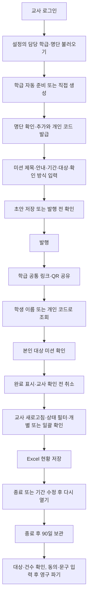

# 학급 미션 기능 리뷰 (codex)

- 날짜: 2026-10-01 (한국 시간)
- 브랜치: `codex/feature-review-class-missions`
- 판정: **수정 필요**. 기본 업무 흐름은 동작하지만 학생 식별, 공용 기기 나가기, 충돌 복구, 교실 동시 참여에서 우선 수정할 문제가 있다.
- 범위: 학급 미션의 교사·학생 화면, 설정 명단 연동, 진행 업무·파기 예정 목록 연결, 공통 규칙, 두 Edge Function, 관련 SQL·테스트.
- 방식: 설치된 Google Chrome의 헤드리스 자동 조작, 전체 화면 캡처, 가상 데이터, 로컬 데모, 실제 서버 코드의 모의 HTTP 계약 검사. 실제 교사·학생 인터뷰나 전문가 검토는 수행하지 않았다.
- 이번 변경: 리뷰 문서·재현 도구·증거·개발일지. 제품 코드, 기존 테스트, DB, 배포 설정은 변경하지 않았다. 발견한 결함은 아직 수정하지 않았다.

## 1. 워크플로우



### 교사의 준비·발행

1. `/tools/class-missions`에서 로그인한 교사의 학급을 읽는다. 데모는 별도 가상 localStorage를 쓴다.
2. 설정의 담당 학급 표기와 명단을 읽고 새 학생만 추가한다. 동명 학급 여러 개, 번호·이름 충돌, 데모/서버 모드 불일치에서는 자동 등록을 중단하고 안내한다.
3. 직접 학급을 만들고 붙여넣기 또는 공통 명단 가져오기 화면으로 학생을 등록할 수도 있다. 학급 12개, 학생 60명, 미션 60건 제한이다.
4. 등록 때 개인 코드를 발급하고 교사 화면에서 한 번 보여 준다. 학생 화면은 현재 이름만 안내하지만 같은 입력칸에 개인 코드를 넣어도 접속한다.
5. 새 미션은 전체 학생이 기본 대상이다. 제목·안내·시작일·마감일·교사 확인 여부를 설정하고 초안 저장 또는 발행 전 확인을 거친다.
6. 발행 후 대상 학생 스냅샷과 확인 방식은 고정된다. 제목·안내·기간은 수정할 수 있다. 새 학생의 자동 추가는 이미 발행한 미션의 대상을 바꾸지 않는다.

### 학생의 수행·교사 확인

1. `/s/missions/:token`의 공통 QR은 학급별로 유지된다. 새 미션 발행 후 학생이 새로고침하면 같은 QR로 새 미션을 본다.
2. 이름 또는 개인 코드를 서버에서 해당 학급 명단과 대조한다. 공개 응답에는 선택된 학생의 이름과 대상 미션만 포함한다.
3. 진행 상태이며 시작일부터 마감일까지인 미션에서 `완료했어요`를 누른다. 교사 확인이 필요하면 `확인 대기`, 그렇지 않으면 `완료 표시`가 된다.
4. 교사 확인 전에는 기간 안에서 취소할 수 있다. 교사 확인·해당 없음 상태는 학생이 직접 변경할 수 없다.
5. 교사는 새로고침 후 상태별 필터와 개별·일괄 확인 또는 정정을 쓴다. 교사 화면은 학생 응답을 자동 갱신하지 않는다.
6. Excel은 학생 완료 표시와 교사 확인을 별도 열로 기록한다. 해당 없음은 완료율 분모에서 제외한다.

### 종료·보관·파기

- 마감 경과는 자동 종료가 아니다. 교사가 종료해야 `closedAt`이 기록되고 고정 90일 보관을 시작한다. 진행 중 목록에는 마감 지난 열린 미션도 남는다.
- 종료하면 학생의 새 표시를 막는다. 마감일을 연장한 뒤 다시 열 수 있으며 재종료 시 보관 기산점도 다시 시작한다.
- 만료 미션은 설정의 파기 예정 목록에서 학급·미션 상세 경로로 연결된다. 이 연결은 코드와 기존 테스트를 읽었으며 이번 브라우저 실행에서는 설정 목록 이동을 재검증하지 않았다.
- 영구 파기는 기간·대상·응답·이력 수·버전을 재검사한다. 교사는 동의 체크와 `영구 파기` 문구를 입력한다. 상태가 바뀌면 입력한 동의가 초기화된다.
- 마지막 미션이면 명단·코드도 비우고 토큰을 바꾸며 공개 링크를 중지한다. 빈 중지 학급은 설정 명단을 자동 재등록하지 않는다.
- Storage 파일은 없다. SQL은 이전 암호화 보드 행 삭제, 개인정보를 제거한 행 재삽입, 비식별 감사 기록을 트랜잭션으로 묶는다. 실제 PostgreSQL 실행·RLS·백업 제거 시점은 이번에 확인하지 않았다.

## 2. 발견 사항과 우선순위

P1은 기록 정확성·공용 기기 노출·작업 유실·일반적인 교실 참여에 영향을 주는 항목이다. P2는 주요 흐름·접근성·회귀 검증 개선, P3는 상태 안내의 일관성 개선이다. 아래 증거는 실제 운영 장애 신고가 아니라 로컬 재현 또는 명시된 모의 검사다.

### F1 · P1 · 동명이인의 완료가 첫 번째 학생에게 저장됨

- 재현: `1 가상동명`, `2 가상동명`을 등록하고 이름 `가상동명`으로 접속해 완료 표시했다. 첫 학생에게만 기록되고 두 번째 학생의 상태는 표시 전으로 남았다.
- 원인: 명단 파서는 같은 이름을 허용하지만 공개 조회·저장은 이름 일치에 `find`를 사용한다. 학생 화면에는 번호를 구분하는 행동이 없다.
- 영향: 두 번째 학생이 안내된 이름 방식으로 자신의 기록을 보거나 완료 처리할 수 없으며 첫 학생 기록을 바꿀 수 있다.
- 근거: [서버 이름 선택](../../../supabase/functions/_shared/classMissionsServer.ts#L298), [데모 이름 선택](../../../src/features/classMissions/missionApi.ts#L179), [명단 파서](../../../supabase/functions/_shared/classroomRoles.ts#L414), [모바일 캡처](evidence/duplicate-name-mobile.png).
- 개선: 이름이 여러 명과 일치하면 임의 선택을 중단하고 번호와 이름 또는 개인 코드로 구분한다. 학생 화면에 개인 코드 입력 경로를 안내하고 클라이언트·서버·데모 규칙을 맞춘다.
- 확인 수준: Chrome 재현과 실제 공개 서버 핸들러의 모의 HTTP 재현 모두 확인했다. 두 번째 학생의 코드로 조회하면 미완료임을 서버 검사에서도 확인했다.

### F2 · P1 · ‘나가기’ 후 늦게 도착한 응답이 이전 학생 화면을 다시 표시함

- 재현: 개인 코드로 접속한 뒤 코드 해시 처리를 1.5초 지연했다. `완료했어요` → 저장 중 `나가기`를 눌렀다. 이름 입력 화면이 나타났다가 기존 학생의 이름·미션·완료 상태가 다시 나타났다.
- 원인: `leave`는 화면 상태만 지우며, 진행 중 `mark`/`refresh`의 응답을 무효화하지 않는다. 완료 요청이 끝나면 조건 없이 `setView(updated)`를 실행한다. 나가기 버튼은 저장 중에도 활성 상태다.
- 영향: 공용 기기를 다음 학생에게 넘겼을 때 이전 학생 정보가 다시 보인다. 이름 상태는 비워진 채 화면만 복구되어 이후 조작도 일관되지 않다.
- 근거: [나가기](../../../src/features/classMissions/PublicClassMissionsPage.tsx#L48), [저장 응답 적용](../../../src/features/classMissions/PublicClassMissionsPage.tsx#L59), [재표시 캡처](evidence/logout-restored-mobile.png).
- 개선: 접속 세션/요청 세대 식별자를 두고 나가기·토큰 변경 시 이전 요청 결과를 폐기한다. 새로고침 응답에도 적용한다. 화면을 나갈 수 없게 막는 것만으로 공용 기기 복구를 대체하지 않는다.
- 확인 수준: 실제 Chrome UI와 실제 데모 API를 사용했으며 지연은 시험용 해시 지연이다. 원격 네트워크에서 재현했다고 보고하지 않는다.

### F3 · P1 · 학생 제출로 생긴 교사 저장 충돌을 새로고침하면 작성 중 미션이 사라짐

- 재현: 교사 화면이 열린 상태에서 학생이 완료를 표시했다. 교사가 상태를 정정하자 버전 충돌 안내와 미처리 Promise 오류가 발생했다. 별도로 새 미션 제목을 작성한 상태에서 학생이 완료를 취소한 후 초안 저장을 누르면 충돌한다. 안내대로 새로고침하고 다시 새 미션을 열면 제목이 빈 값이다.
- 원인: 학생과 교사가 암호화 보드 전체의 버전을 공유한다. 교사 화면은 실시간 갱신되지 않는다. `refresh`가 `loading=true`로 전체 업무 영역을 언마운트하여 `MissionEditor`의 로컬 입력을 잃는다. `mutate`는 오류를 다시 던지지만 일부 UI 호출은 `void mutate(...)`만 실행한다.
- 영향: 수업 중 일반적인 학생 제출로 교사 작성이 실패하고 복구 안내를 따르면 입력까지 잃는다. 서버의 충돌 감지 자체는 기록 덮어쓰기를 막는 정상 보호 장치다.
- 근거: [새로고침](../../../src/features/classMissions/ClassMissionsWorkspace.tsx#L120), [미처리 오류](../../../src/features/classMissions/ClassMissionsWorkspace.tsx#L162), [정정 호출](../../../src/features/classMissions/ClassMissionsWorkspace.tsx#L241), [서버 버전 검사](../../../supabase/functions/_shared/classMissionsServer.ts#L145), [오류 캡처](evidence/teacher-stale-error.png).
- 개선: 편집 중 입력을 상위 상태에서 보존하고 충돌 복구 시 목록만 갱신한다. 최신 버전을 확인한 뒤 교사가 재시도하도록 제공한다. 정정·링크 조작의 Promise 오류를 처리한다. 변경된 수량을 확인하는 일괄 확인·파기는 무조건 자동 재시도하지 않는다.
- 확인 수준: Chrome에서 저장 충돌, pageerror 1건, 새로고침 뒤 빈 제목을 확인했다.

### F4 · P1 · 같은 학교 IP의 24명 동시 참여가 분당 40회 제한에 걸림

- 재현: 같은 가상 학교 IP에서 24명의 `조회 1회 + 완료 1회`에 해당하는 48회 요청을 한 제한 창 안에 보냈다. 40회는 200, 나머지 8회는 429였다.
- 원인: 이름 조회와 완료 저장 모두 `public:<IP>`의 60초·40회 한도를 소비한다. 학급 토큰은 별도 400회 한도지만 IP 한도가 먼저 적용된다. IP 버킷에는 학급 토큰도 포함하지 않아 같은 학교의 여러 학급이 한도를 공유한다.
- 영향: 학교 Wi-Fi/NAT처럼 공개 IP를 공유하는 환경에서 정상적인 수업 참여가 제한될 수 있다. 모든 학교가 같은 IP 구조라고 가정한 것은 아니다.
- 근거: [공개 요청 제한](../../../supabase/functions/_shared/classMissionsServer.ts#L289), [RPC 카운터](../../../supabase/migrations/202608130001_registry_auth_and_public_api.sql#L233), [서버 재현 도구](server-probes.test.ts).
- 개선: 동시 참여 인원과 조회·저장·취소·재시도 요청 수를 기준으로 한도를 설계하고 토큰·학생 단위 제한을 결합한다. 이름 기반 접근의 추측 공격 억제도 유지한다. 공용 IP 하나만으로 학생 전체를 너무 낮은 한도에 묶지 않는다.
- 확인 수준: 실제 공개 핸들러가 넘기는 제한 값을 읽고, SQL과 같은 카운터 의미의 모의 RPC로 재현했다. 24개의 서로 다른 실제 학생 계정이나 원격 DB 부하 시험은 아니다.

### F5 · P2 · 학생의 현재 미션보다 종료된 미완료 미션이 먼저 보임

- 재현: 종료된 미완료 미션 5개와 현재 수행 가능한 미션 1개로 접속했다. 종료 미션이 모두 먼저 나오고 현재 미션의 완료 버튼은 페이지 상단 기준 y=1666px에 있었다(390×844 창).
- 원인: 정렬이 미표시 여부와 마감일만 비교한다. 완료 표시 가능 여부·종료·마감 경과를 우선하지 않는다.
- 영향: 학생은 처리할 수 없는 과거 미션을 먼저 읽고 현재 할 일을 찾기 위해 내려가야 한다. 상단 완료 수에도 과거 미완료가 포함되어 현재 해야 할 일의 수와 다르다.
- 근거: [정렬](../../../src/features/classMissions/PublicClassMissionsPage.tsx#L65), [전체 캡처](evidence/closed-first-mobile.png).
- 개선: 현재 할 수 있는 미션을 먼저 보여 주고 시작 전·마감 경과·종료는 별도 그룹 또는 접을 수 있는 기록으로 둔다. 전체 기록을 숨기지 않고 현재 할 일 수와 전체 완료 기록을 구분한다.

### F6 · P2 · 교사의 반복 업무보다 학급 생성·QR 공유 영역이 먼저 큰 공간을 차지함

- 재현: 명단을 접고 코드 목록도 닫은 24명·미션 1개 화면에서 현황 패널의 시작이 y=1023px이었다(1366×900 창). QR 하단 오른쪽에 넓은 빈 공간이 있고 새 학급 생성 입력도 매번 상단에 남는다.
- 영향: 학생 확인을 반복하는 교사와 전자칠판에서 첫 화면에 현황·대기자·완료 상태가 들어오지 않는다. 60명에서는 목록 자체도 길다.
- 근거: [교사 24명 전체 화면](evidence/teacher-24-desktop.png), [교사 60명 전체 화면](evidence/teacher-60-desktop.png), [측정 결과](evidence/results.json).
- 개선: 첫 학급 준비 이후에는 학급 선택을 압축하고 학급 추가·공유 설정을 보조 영역으로 이동한다. 미션 목록과 현황·확인 대기를 위로 올리고 QR은 필요한 때 펼친다. 전자칠판에는 현재 미션과 상태를 집중해서 표시하는 보기의 필요성을 실제 교사에게 검증한다.
- 확인 수준: 화면 우선순위에 대한 AI 모의 디자인 평가다. 실제 교사의 처리 시간이나 만족도를 측정한 결과는 아니다.

### F7 · P2 · 학생 화면 보조 문구 두 곳의 대비 검사 실패

- axe 결과: `새 미션이 추가되면…`, `공용 기기라면…`의 글자 `#64748B` / 배경 `#F4F8FC` 대비가 4.45:1로, 검사 기대값 4.5:1보다 낮다. 12px 일반 글자이며 color-contrast 위반 노드 2개다.
- 교사 60명 모바일 화면의 동일 자동 검사에서는 위반이 없었다. 자동 통과가 모든 접근성의 통과를 뜻하지 않는다.
- 근거: [문구 위치](../../../src/features/classMissions/PublicClassMissionsPage.tsx#L73), [학생 모바일 전체 화면](evidence/student-active-mobile.png), [axe 세부 결과](evidence/results.json).
- 개선: 보조 글자의 명도를 낮춰 대비 여유를 확보한다. Enter 접속 직후 포커스가 BODY로 이동하는 것도 확인했으므로, 화면 전환 시 새 제목/적절한 시작 위치의 포커스와 안내를 검토한다. 스크린리더 실사용은 미검증이다.

### F8 · P2 · 현재 화면 변경이 기존 E2E에 반영되지 않음

- 실행 결과: `class-missions.spec.ts`의 9개 중 3개 통과, 3개 실패, 3개 미실행. 15초 제한·최대 실패 3개로 중단했다.
- 실패 원인: 존재하지 않는 `개인 접속 코드` 입력칸, 이전 문구 `학급 명단과 개인 접속 코드`를 기다린다. 현재 화면은 `학생 이름`, `학급 명단 및 개인 코드`다. 긴 서버 작업의 타임아웃으로 판정하지 않았다.
- 영향: 발행·학생 응답·교사 확인·24/60명·파기 같은 핵심 시나리오가 오래된 selector에서 중단되어 실제 회귀를 찾지 못한다.
- 근거: [오래된 명단 selector](../../../tests/e2e/class-missions.spec.ts#L15), [오래된 학생 입력 selector](../../../tests/e2e/class-missions.spec.ts#L63), [이번 현재 UI 검증 도구](verify.mjs).
- 개선: 확정된 이름/코드 접속 UI의 접근 가능한 이름으로 테스트를 갱신하고 F1~F5의 회귀 시나리오를 추가한다. 기존 테스트를 이번에 변경하거나 실패를 통과로 처리하지 않았다.

### F9 · P3 · 시작 전 미션을 교사는 ‘진행 중’으로 봄

- 재현: 시작일이 일주일 뒤인 열린 미션을 만들면 교사 현황·목록은 `진행 중`, 학생은 `시작 전`이다. 진행 업무 공급자도 마감만 비교하여 같은 표시를 쓴다.
- 근거: [교사 날짜 상태](../../../src/features/classMissions/ClassMissionsWorkspace.tsx#L184), [진행 업무 공급자](../../../src/features/activeWork/activeWorkProviders.ts#L178), [재현 결과](evidence/results.json).
- 개선: 공개 상태(open)와 날짜 상태(시작 전/기간 내/마감 경과)를 구분하고 공통 상태 문구 함수를 재사용한다.

## 3. 작업별 휴리스틱 디자인 평가

AI의 모의 평가다. 아래 원칙별로 실제 과제와 증거를 연결했으며 점수 평균으로 결함을 상쇄하지 않았다.

| 휴리스틱 | 판정 | 업무에 반영된 점 / 부족한 점 |
| --- | --- | --- |
| 시스템 상태 가시성 | 부분 충족 | 완료·대기·교사 확인 문구와 색, 상태 수, 저장 성공 안내가 있다. 교사 자동 갱신은 없고 시작 전을 진행 중으로 표시한다(F3, F9). |
| 현실 업무와의 대응 | 부분 충족 | 학생 자기보고와 교사 확인을 구분하고 Excel에도 별도 열로 기록한다. 동명이인 식별은 실제 학급 명단에 대응하지 못한다(F1). |
| 사용자 통제·취소 | 수정 필요 | 확인 전 완료 취소·다시 수정·미션 재열기를 제공한다. 나가기 후 재표시와 새로고침 입력 유실이 있다(F2, F3). |
| 일관성 | 부분 충족 | 버튼 스타일과 상태 문구는 대체로 일치한다. 교사 안내의 개인 코드 사용과 학생의 이름 전용 안내, 교사·학생 기간 문구가 어긋난다(F1, F9). |
| 오류 예방 | 부분 충족 | 발행 전 확인, 발행 후 대상·방식 잠금, 파기 수량·동의 재검사가 유효하다. 동명이인을 임의로 선택한다(F1). |
| 기억보다 인식 | 부분 충족 | 이름 입력, 대상 전체 선택, 예시·명단 안내가 있다. 개인 코드 대체 경로를 학생이 알아보기 어렵고 현재 수행할 미션이 묻힌다(F1, F5). |
| 작업 효율 | 수정 필요 | 상태 필터·일괄 확인·복제·QR 재사용이 있다. 교실 IP 제한과 상단 공유 영역이 반복 업무를 방해한다(F4, F6). |
| 간결한 정보 구성 | 수정 필요 | 명단을 접고 완료 상태를 문자와 색으로 보여 준다. QR 영역의 공백과 항상 보이는 새 학급 입력, 종료 미션이 과제 목록을 길게 만든다(F5, F6). |
| 오류 이해·복구 | 수정 필요 | 안전한 한국어 오류, 재시도와 충돌 안내가 있다. 안내한 새로고침이 작성 중 내용을 지우고 일부 오류는 미처리 Promise로 남는다(F3). |
| 도움말·안내 | 부분 충족 | 빈 학급·빈 미션, 완료/교사 확인 차이, 보관·파기 설명이 있다. 동명이인·개인 코드 접속·충돌 복구에 실행 가능한 안내가 필요하다. |

### 세 프로파일과 여섯 모의 관점

검토 전에 `pro/web-designer.md`, `pro/ux-designer.md`, `pro/ui-designer.md`를 읽었다. 여섯 행은 서로 다른 평가 기준을 적용한 AI 모의 관점이며 실제 전문가 6명이나 병렬 에이전트의 독립 검토가 아니다. 제품 화면을 수정하지 않았으므로 2차 구현·수정 후 재검증을 했다고 보고하지 않는다.

| 관점 | 판정 | 근거 | 수정 요구 / 남은 위험 |
| --- | --- | --- | --- |
| 웹디자인: 정보 위계 | 수정 필요 | 24명 화면의 현황 시작 y=1023px. 준비·공유가 일상 확인보다 앞에 있다. | F6. 실제 교사 과제별 소요 시간은 미측정. |
| 웹디자인: 화면 밀도 | 수정 필요 | 전체 캡처에서 QR 오른쪽과 미션 카드 오른쪽 공백이 크다. 학생 목록은 24/60명에서 두 열 균형을 유지한다. | 공유 영역 압축. 60개 미션 전체 목록의 밀도는 미검증. |
| UX: 학생 흐름 | 수정 필요 | 이름 Enter 접속·완료·취소·확인 반영은 동작. 동명 선택, 나가기 경쟁, 종료 우선 정렬이 재현된다. | F1, F2, F5. 실제 학생 사용성 시험은 미수행. |
| UX: 교실 전자칠판 | 수정 필요 | 일괄 확인·이름 가림은 제공하나 현황이 첫 화면 밖이다. 저장된 코드 패널이나 펼친 명단까지 이름 가림이 적용되는 것은 아니다. | F4, F6. 전자칠판 전용 과제와 이름 가림 범위 설명을 교사와 검증할 필요. |
| UI: 접근성 | 수정 필요 | 교사 60명 모바일 axe 0건, 학생 모바일 대비 위반 노드 2개. Enter 제출을 실행했고 접속 뒤 포커스가 BODY였다. | F7. 전체 키보드 순회, 스크린리더, 모든 테마의 수동 대비는 미검증. |
| UI: 반응형·상태 표현 | 부분 통과 / 수정 필요 | 390px와 CSS 200%에서 가로 넘침 없음. 긴 이름 줄바꿈·미표시/완료/대기/확인/해당 없음이 문자로 구분된다. | F9. CSS 확대는 실제 브라우저 UI 확대나 모든 기기의 검증을 대신하지 않는다. |

## 4. 검증 결과

| 검사 | 결과 | 범위·한계 |
| --- | --- | --- |
| `npm run typecheck` | 통과 | 프런트엔드 프로젝트 참조를 포함한 타입 검사. Edge Function 검사와 구분. |
| `npm run lint` | 오류 없음, 기존 경고 6건 | 특별실·공통 컴포넌트 등 다른 화면의 기존 경고. 이번 학급 미션 제품 코드 변경 없음. |
| 학급 미션 관련 Vitest 4개 파일 | 12개 통과 | `classMissions`, `classMissionExcel`, `missionSettingsSync`, `missionSettingsSyncModes`. |
| 기존 Deno 서버 계약 테스트 | 7개 통과 | 실제 핸들러 + 모의 HTTP. 인증·소유자·파기·이름/코드 응답 계약. 실제 RLS/트랜잭션 아님. |
| 두 Edge Function의 `deno check` | 통과 | 캐시된 Deno 및 의존성 사용. 원격 배포 확인 아님. |
| 기존 학급 미션 E2E | 3개 통과 / 3개 실패 / 3개 미실행 | 오래된 selector로 중단. 다른 미실행 검사를 통과로 보고하지 않음. |
| 학급 미션 앱 스크롤 E2E | 1개 통과 | 해당 경로를 맨 아래까지 내려 빈 바닥 확인. |
| 현재 UI 브라우저 재현 도구 | 8개 시나리오 수행 완료 | 정상 흐름·파기 확인 2개와 문제 재현/진단 6개. 실행 완료가 기능 무결성을 뜻하지 않음. 최종 결과 JSON에 각 결과 구분. |
| 추가 서버 재현 도구 | 2개 재현 완료 | 동명 기록 오선택과 IP 제한을 확인하는 검사. 수정 전 결함이 재현돼야 성공하는 리뷰용 probe. |
| QR·Excel 파일 내용 | 확인 | PNG 1024×1024. 저장한 실제 Excel을 다시 읽어 확인 학생과 미표시 학생의 두 완료 열·현재 상태 확인. QR 스캔 인식과 Excel 인쇄 레이아웃은 미검증. |
| 화면·자동 접근성 | 확인, 학생 대비 실패 | 0명·24명 혼합 상태·60명 긴 이름, 데스크톱 1366px·모바일 390px·CSS 200% 전체 캡처. |

실행 명령:

```powershell
npm run typecheck
npm run lint
npm test -- tests/unit/classMissions.test.ts tests/unit/classMissionExcel.test.ts tests/unit/missionSettingsSync.test.ts tests/unit/missionSettingsSyncModes.test.ts
deno test --cached-only --allow-env --node-modules-dir=manual tests/server/classMissions.test.ts
deno check --cached-only --node-modules-dir=manual supabase/functions/class-missions-admin/index.ts supabase/functions/class-missions-public/index.ts
$env:PLAYWRIGHT_TEST_PORT='4175'
npm.cmd run test:e2e -- tests/e2e/class-missions.spec.ts --max-failures=3 --timeout=15000
npm.cmd run test:e2e -- tests/e2e/app-shell-scroll.spec.ts --grep '학급 미션'
node design/feature-reviews/2026-10-01-class-missions/verify.mjs
deno test --cached-only --allow-env --node-modules-dir=manual design/feature-reviews/2026-10-01-class-missions/server-probes.test.ts
```

`deno`는 PATH에 없어 캐시된 실행 파일의 절대 경로로 실행했다. `npm run dev -- --host ...`는 이 PC의 PowerShell/npm 전달 과정에서 옵션이 빠져 실패하여 아래처럼 Vite 진입점을 직접 실행했다. 브라우저 도구도 설치를 추가하지 않고 캐시된 `agent-browser`를 사용했다. 제한된 실행에서 브라우저 데몬 연결이 끊겨 해당 로컬 Chrome 실행을 허용된 권한으로 다시 열었다. 최종 화면·재현 증거는 성공한 실행에서 얻었다.

현재 UI 재현 도구는 독립 가상 브라우저 context를 사용하며 로컬 주소만 허용한다. 첫 작성 때 selector 다중 일치와 Excel 리더 반환 형식에 따른 도구 오류를 고친 뒤 해당 시나리오를 재실행해 최종 결과를 기록했다. 이를 제품 결함으로 분류하지 않았다.

재현 서버를 새로 열 때:

```powershell
$env:VITE_CLASS_MISSIONS_DEMO_MODE='true'
$env:VITE_CLASSROOM_ROLES_DEMO_MODE='true'
$env:VITE_REGISTRY_DEMO_MODE='true'
$env:VITE_STUDENT_RESULTS_DEMO_MODE='true'
$env:VITE_CONSENT_FORMS_DEMO_MODE='true'
$env:VITE_SPECIAL_ROOMS_DEMO_MODE='true'
$env:VITE_PUBLIC_APP_URL='http://127.0.0.1:4175'
node node_modules/vite/bin/vite.js --host 127.0.0.1 --port 4175 --strictPort
```

### 증거 목록

- [최종 시나리오 결과와 axe 세부 정보](evidence/results.json)
- [빈 교사 화면](evidence/teacher-empty.png)
- [24명 데스크톱](evidence/teacher-24-desktop.png), [24명 모바일](evidence/teacher-24-mobile.png), [24명 CSS 200%](evidence/teacher-24-zoom-200.png)
- [60명 데스크톱](evidence/teacher-60-desktop.png), [60명 모바일](evidence/teacher-60-mobile.png)
- [학생 수행 가능](evidence/student-active-mobile.png), [학생 교사 확인 완료](evidence/student-confirmed-mobile.png)
- [동명 학생](evidence/duplicate-name-mobile.png), [로그아웃 후 재표시](evidence/logout-restored-mobile.png), [교사 충돌](evidence/teacher-stale-error.png), [종료 미션 우선 정렬](evidence/closed-first-mobile.png)
- [파기 확인 전체 화면](evidence/teacher-purge.png)
- 실제 내려받은 가상 명단 QR PNG와 미션 현황 XLSX도 `evidence/`에 보존했다.

## 5. 보안·운영 확인 한계

- 명단·코드 해시·대상·이력의 서버 암호화, 인증된 교사 소유자 검사, 브라우저 DB 권한 회수, 버전 검사, 공개 응답의 타 학생 정보 제외를 코드와 모의 테스트에서 확인했다.
- **이름으로 조회하는 것은 강한 본인 인증이 아니다.** 현재 제품 정책상 토큰과 등록된 이름을 아는 사람은 그 학생의 미션 조회·자기보고를 대신할 수 있다. 기존 정책상의 제한으로 기록하며, 이를 새로 발견한 인증 우회 취약점이라고 단정하지 않는다. 민감한 미션 안내를 허용할지, 개인 코드를 필수로 할지는 제품 정책 검토가 필요하다.
- 원격 Supabase, 실제 RLS, 실제 SQL 트랜잭션, 운영 함수 버전, 실제 학교 IP/태블릿·전자칠판, 인터넷 QR 재접속은 검증하지 않았다. 시험 환경·자료가 지정되지 않아 원격 쓰기 시험을 실행하지 않았다.
- 전체 단위 테스트와 빌드는 실행하지 않았다. 학급 미션 제품·공통 로직·의존성·번들을 변경하지 않은 리뷰이며 관련 검사로 범위를 한정했다.
- A4/PDF는 이 기능의 현재 출력 경로가 아니다. Excel 저장은 검증했으나 Excel의 인쇄 결과를 별도로 렌더링하지 않았다.
- 저장소 밖 `../schooldoc-docs/development-history.md`와 `pro/ux-ui-expert.md`는 없다. 지정된 세 프로파일은 읽었고 새 로컬 `docs/development-history.md`에 이번 항목만 기록했다. 과거 이력은 복원하거나 추측하지 않았다.
- 작업 중 별도로 생긴 `AGENTS.md` 수정과 `.github/`, 처음부터 존재하던 `docs/영수증폴더`는 이번 리뷰 수정에 포함하지 않았다.

## 6. 후속 순서

1. 학급 미션: 이번 분석 완료. F1~F4를 먼저 수정하고 해당 재현을 원하는 동작의 회귀 검사로 전환해야 한다. F5~F9도 화면·검증 개선에 반영한다.
2. 1인 1역: 다음 리뷰 대상. 이번에는 분석하지 않았다.
3. 학생 결과 안내 → 가정통신문 수합 → 등록부 서명 → 자료 수합 → 특별실 예약: 요청한 순서로 대기.

GitHub push·PR·main 병합은 하지 않았다. DB 마이그레이션·Edge Functions·프런트엔드 운영 배포는 모두 미적용이다.

### 작업 폴더 분리

검증 기준 커밋은 `ebd5a5b`이다. 작업 도중 다른 작업이 공유 checkout을 `codex/github-writing-guidelines` 브랜치로 전환했다. 같은 기준 커밋의 전용 `class-missions-review` 워크트리에 `codex/feature-review-class-missions`를 연결하고 이번 리뷰 자료 19개 파일의 복사 전후 해시를 확인했다. 브라우저·서버 검증은 원래 checkout에서 수행했으며 두 작업 폴더의 제품 코드 기준 커밋은 같다. 기존 사용자 변경은 옮기거나 커밋하지 않았다. 리뷰 문서·도구·증거만 로컬 리뷰 브랜치에 기록하고 개발일지는 Git 커밋에서 제외한다.
