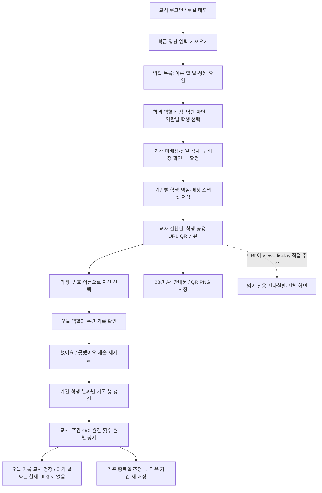

# 1인 1역 기능 리뷰 — 2026-10-01 (codex)

## 결론과 범위

기본 배정·오늘의 학생 자기보고·교사 확인·역할 교체는 정상 동작했다. 기존 기능 E2E 45개와 공통 스크롤 E2E 8개가 실제 Google Chrome에서 통과했다. 다만 역할 설명 전달, 지난 기록 정정, 전자칠판 진입, 초안 보존, 지연 응답의 안내, 인쇄 경계, 학교 IP의 요청 한도, 작은 글자 대비에서 8개 개선 사항을 확인했다. 모두 P2로 분류했다. 이번 검토에서 즉시 운영 중단을 요구하는 P0/P1 결함은 재현하지 않았다.

- 검토 브랜치: `codex/feature-review-classroom-roles`.
- 기준: 제품 소스 `ebd5a5b`, 직전 학급 미션 리뷰 문서 커밋 `7173d3e`에서 분기. 학급 미션 수정 에이전트의 변경은 이 검토에 포함하지 않았다.
- 범위: `/tools/classroom-roles`의 홈·배정·역할 목록·운영 설정·실천판·기록·교체·인쇄, `/s/roles/:token`의 학생 화면·전자칠판, 공유 명단 입력과 공통/서버 규칙.
- 실제 Chrome 154 헤드리스, 로컬 Vite `127.0.0.1:4176`, 가상 학생만 사용했다. 데모의 localStorage 저장·UI 흐름과 모의 HTTP 서버 검사를 분리했다. 다른 기기 공유, 운영 Supabase, 실제 학교 IP·전자칠판·프린터는 검증하지 않았다.
- 제품 코드·기존 테스트·DB·배포는 변경하지 않았다. 리뷰 도구·전체 캡처·PDF 증거를 보존했다. 여기서 `completed: true`는 관찰 절차 수행 완료이며 결함 수정 완료가 아니다.

## 워크플로우

### 상태와 저장 의미

| 단계 | 현재 구현과 유지 조건 | 확인 |
| --- | --- | --- |
| 명단 | 최대 60명, 번호·ID 중복 금지. 동명이인은 번호와 ID로 구분. 기존 번호·이름의 ID 재사용 | 단위·배정 E2E |
| 역할 설정 | 최대 60개, 정원 1~60명, 이름 40자·할 일 500자. 목록 수정은 다음 배정에 적용 | 공통 규칙·역할 목록 E2E |
| 배정 | 모든 학생을 배정해야 확정 가능. 역할 이동 확인·정원 초과 방지·미배정 찾기·확정 전 전체 확인 | Chrome E2E |
| 확정 배정 | 학생·역할·배정 스냅샷을 보존. 시작 전 기간과 진행 중 종료일의 안전한 수정만 허용 | 단위·서버·E2E |
| 실천일 | 학급 요일 + 역할 요일 + 제외일 + 배정 기간으로 계산. 제외일 변경은 집계를 바꾸지만 기록을 지우지 않음 | 단위·설정·공개 E2E |
| 학생 입력 | 공개 토큰으로 접속하고 학생 ID를 선택. 인증된 개인 접속이 아니며 다른 학생도 선택 가능한 학급 공유 방식 | 설정의 공개 안내·서버 규칙 |
| 공개 상태 | 전체 타일 공개 여부와 전자칠판 이름 가림 설정. 가림은 화면 표시 기능이며 접근 통제가 아님 | 공개 E2E |
| 오늘 기록 | 학생은 오늘 done/not_done만, 교사는 done/not_done/exempt/missing을 저장. 재제출은 한 행 갱신 | 단위·모의 서버·E2E |
| 교사 정정 | 서버는 과거 날짜도 허용하지만 현행 실천판의 날짜는 오늘로 고정 | R2 및 서버 probe |
| 갱신 | 조회를 30초마다 갱신. 학생 기록은 배정 보드 버전을 올리지 않아 학급 미션의 저장 충돌 문제와 다름 | 소스·E2E |
| 인쇄 | 배정 스냅샷을 20칸씩 A4에 출력. 현재 공유 링크 QR과 1024×1024 PNG 저장 제공 | 정상 PDF·PNG·E2E, R6 |

보관·영구 파기를 제공하는 별도 기능은 이 화면에 없다. 공통 규칙은 최대 60개 배정 기간을 허용한다. 이를 넘어선 장기 운영·자료 이관 정책은 이번에 확인하지 않았다.

## 확인된 사항과 수정 요구

### R1 · P2 · 입력한 ‘할 일’ 설명이 학생에게 전달되지 않음

- **재현:** 역할의 할 일을 `수업이 끝나면 칠판을 닦고 지우개를 정리해 주세요.`로 저장한 배정에서 학생 상세를 연다. 역할 이름·주간 기록·오늘 버튼만 보이고 설명은 없다.
- **근거:** [학생 상세 전체 화면](evidence/student-detail-missing-description.png), `results.json`의 `descriptionRendered: 0`. 서버 projection은 설명을 반환하지만 `PublicClassroomRolesPage.tsx:235` 이후 상세에서 `student.role.description`을 사용하지 않는다. 역할 목록은 할 일을 입력하도록 안내한다.
- **영향:** 역할 이름만으로 구체적 행동을 알기 어려워 교사의 별도 설명에 의존한다. 기록하기 전 자신의 할 일을 확인하는 연결이 끊긴다.
- **수정:** 확정 배정의 설명을 학생 상세에 표시한다. 빈 설명·최대 500자·줄바꿈에서도 주간 기록과 제출 버튼을 사용할 수 있게 한다. 현재 역할 목록에서 수정한 설명을 과거 배정에 소급하지 않는다.
- **완료 기준:** 실제 Chrome 모바일에서 저장된 설명을 읽고 기록을 제출한다. 긴 설명에서 대화상자 스크롤·키보드·버튼 접근을 재검증한다.

### R2 · P2 · 월별 상세의 ‘기록 정정’ 경로로 지난 기록을 고칠 수 없음

- **재현:** 2026-09-30의 `not_done`을 월별 상세에서 확인하고 `실천판에서 기록 정정 →`을 누른다. 이동한 화면에는 날짜 선택 없이 오늘(2026-10-01) 정정만 나온다. `done`을 선택하면 9월 30일은 그대로이고 10월 1일의 행이 생긴다.
- **근거:** [지난 기록](evidence/history-yesterday-no-edit.png), [오늘만 정정되는 화면](evidence/correction-only-today.png), `results.json`. `RoleRecordPages.tsx:434` 링크, `RolePracticeBoardPage.tsx:81`의 `date: today`. 추가 서버 probe는 과거 날짜의 교사 정정 요청을 받아 해당 날짜로 저장하는 계약을 확인했다.
- **영향:** 지난 결석 처리·잘못된 자기보고를 복구하는 UI가 없다. 정정하려던 날짜가 이동하면서 전달되지 않는다.
- **수정:** 월별 상세의 날짜·학생·기간을 교사 정정에 전달하고 대상 날짜를 분명히 표시한다. 미래 날짜는 막고 과거 스냅샷의 학생·배정을 유지한다.
- **완료 기준:** 지난 날짜의 상태만 바뀌고 오늘 행은 변하지 않는 E2E. 월 경계·교체 전 배정·미기록 복구·exempt를 검증한다.

### R3 · P2 · 전자칠판 화면은 존재하지만 교사용 메뉴에서 진입할 수 없음

- **재현:** 오늘의 실천판에서 전체 메뉴와 공유 링크를 확인한다. `view=display`로 가는 링크가 0개다. 주소에 직접 붙이면 읽기 전용 타일과 전체 화면 버튼은 정상 표시된다.
- **근거:** [교사 실천판 전체](evidence/teacher-board-24-desktop.png), [1920×1080 전자칠판](evidence/whiteboard-24-desktop.png), `results.json`의 `displayLinks: 0`. 링크는 `RoleRecordPages.tsx:151`의 `RolePracticePage`에만 남아 있고, 실제 `/board` 라우트는 `ClassroomRolesWorkspace.tsx:305`의 `RolePracticeBoardPage`다.
- **영향:** 교사가 URL 규칙을 알아야 수업 중 읽기 전용 전자칠판을 열 수 있다. 현재 `학생화면` 버튼은 교사용 카드 보기이며 공용 읽기 전용 화면과 다르다.
- **수정:** 실천판에 목적이 분명한 전자칠판 열기 경로를 제공한다. 현재 공개 상태·이름 가림 설정이 적용되도록 한다.
- **완료 기준:** 메뉴 클릭으로 읽기 전용 화면 진입, 제출 버튼 없음, 전체 화면 사용·종료 및 이름 가림 확인.

### R4 · P2 · SPA 탐색으로 미저장 배정·역할 입력이 확인 없이 사라짐

- **재현 A:** 배정에서 학생 한 명을 선택 → Chrome 뒤로 가기 → 다시 배정 화면 진입. 확인창 0회, 선택한 배정이 사라진다.
- **재현 B:** 역할 목록의 이름을 바꾸고 스쿨독 홈 버튼으로 이동 → 돌아오기. 확인창 0회, 이전 저장 값으로 돌아간다.
- **근거:** [사라진 배정 초안](evidence/assignment-browser-back-draft-lost.png), `results.json` 두 시나리오. `RoleAssignmentPage.tsx:97`의 beforeunload는 문서 이탈 대상이고 `:142`의 guardLeave는 일부 Link에만 연결되어 있다. 역할 목록의 편집은 `RoleConfigurationPages.tsx:24` 로컬 state에만 있다.
- **영향:** 여러 학생의 배정이나 긴 역할 설명 입력을 복구할 수 없다. 특정 링크에서는 확인하지만 브라우저 뒤로 가기에서는 조용히 사라져 일관성도 없다.
- **수정:** 라우터 이동·뒤로 가기·앱 메뉴에 공통 이탈 보호 또는 복원 가능한 초안을 적용한다. 저장·취소 후에는 경고를 해제한다. 공유 데이터와 확정 배정에는 영향을 주지 않는다.
- **완료 기준:** 뒤로 가기·앞으로 가기·앱 메뉴·문서 닫기의 보존/취소/이동 선택을 검증한다. 최소 배정과 역할 목록의 기존 입력 유실 재현을 회귀 테스트로 바꾼다. 운영 설정의 같은 로컬 state 위험도 함께 확인한다(설정 유실은 이번에 따로 UI 재현하지 않음).

### R5 · P2 · 지연된 저장 성공 안내가 다른 학생 상세에 나타남

- **재현:** 1번 학생의 했어요 저장을 지연 → 상세 닫기 → 2번 선택. 2번의 오늘 상태는 미기록인데 `했어요로 저장했어요.` 안내가 나타난다. 실제 저장 행은 1번 학생이다.
- **근거:** [다른 학생에게 나타난 성공 안내](evidence/late-feedback-on-another-student.png), `results.json`. `PublicClassroomRolesPage.tsx:108`은 요청 당시 선택과 현재 선택을 비교하지 않고 message·retry·busy를 바꾼다. 닫기 버튼은 저장 중에도 사용할 수 있다.
- **검증 조건:** 로컬 검토 도구가 브라우저에 전달된 API 모듈의 `writeRoleRecord` 경계에 1500ms 지연을 삽입했다. 제품 파일을 바꾸거나 운영 응답을 조작한 것이 아니다. 실제 원격 네트워크 지연 자체는 검증하지 않았다.
- **수정:** 요청의 학생/세션과 현재 상세가 일치할 때만 안내와 상태를 반영한다. 실패 안내도 같은 방식으로 격리하고, 닫기·학생 전환·복수 요청의 busy 의미를 명확히 한다.
- **완료 기준:** 지연된 성공·실패 후 다른 학생의 상세는 자신의 상태만 표시한다. 원래 요청 학생의 저장 행은 그대로 유지한다.

### R6 · P2 · 허용된 많은 담당 학생이 A4 안내문의 다른 영역을 덮음

- **정상 확인:** 24명·18개 역할·20칸의 안내문은 실제 PDF 한 장(595.92×842.88pt)에 들어갔다. [정상 PDF 렌더](evidence/poster-normal-render.png).
- **재현:** 유효성 검사를 통과한 60명·한 역할·정원 60명의 안내문을 출력한다. 학생 이름이 제목·구분선·다른 칸 위로 겹친다.
- **근거:** [문제가 있는 PDF 전체 렌더](evidence/poster-60-one-role-render.png). 화면 측정은 칸 높이 71.70px, 내용 높이 364.50px. `RolePosterPrintPage.tsx:95`의 고정 10행과 `:107`의 모든 학생 이름 연결이 충돌한다. 공통 규칙은 정원 60명을 허용한다.
- **영향:** 미리보기와 인쇄 PDF가 모두 훼손된다. 화면 배정은 유효하지만 결과물을 사용할 수 없다.
- **수정:** 넘치는 이름을 조용히 자르지 않는다. 20칸 안내문 구조를 유지하면서 추가 명단 페이지 등 모든 이름을 보존하는 출력 방식을 제공한다. 역할명 40자·학생 이름 40자도 함께 고려한다.
- **완료 기준:** 대표 24명과 경계 데이터의 전체 PDF를 렌더링해 잘림·겹침 0개, 모든 이름 보존, QR·페이지 수 확인. 실제 프린터 검증과는 구분한다.

### R7 · P2 · 60명 정상 사용 한 주기로 학교 공용 IP 제한에 걸림

- **재현:** 같은 가상 IP에서 60명 각각 `화면 열기 → 상세 선택 → 기록 → 저장 결과 조회 → 상세 닫기`의 5요청을 한 60초 창에 수행한다. 300요청 중 240개 성공, 60개는 429다. 30초 자동 갱신은 이 계산에서 제외했다.
- **근거:** `server-probes.test.ts` 두 번째 검사. 서버는 공개 토큰과 무관한 IP 공통 키로 240회/60초를 적용한다(`classroomRolesServer.ts:105`~`:120`). UI는 선택·닫기·저장 후 선택 상세 변경마다 조회한다.
- **영향과 조건:** 60명이 동시에 참여하거나 여러 반이 같은 학교 외부 IP를 쓰면 정상 조회·제출이 지연될 수 있다. 24명 한 반의 단일 주기만으로 이 한도를 넘는다고 주장하지 않는다. 운영 NAT 동작은 미검증이다.
- **수정:** 유효한 학급의 동시 사용량과 악성 반복 요청 방어를 분리한다. 읽기 갱신·학생 전환의 불필요한 조회도 줄인다. limiter 실패 시 차단 정책은 유지한다.
- **완료 기준:** 가상 60명 동시 정상 흐름과 같은 IP의 복수 학급, 반복 악성 제출·제한 서비스 실패를 함께 검증한다.

### R8 · P2 · 교사 화면의 작은 보조 글자 대비가 기준에 조금 못 미침

- **재현:** 교사 실천판을 axe로 확인하면 `#64748B` 글자 / `#F6F8FB` 배경의 12px 안내가 4.47:1로 측정된다. 요구 4.5:1보다 낮다.
- **근거:** `results.json`의 color-contrast 노드 2개: 개발 데모 안내와 맨 아래 O/X 범례. 개발 데모 안내는 운영에서는 숨겨지지만 범례는 운영에도 해당한다. 학생 상세의 이번 axe 검사는 위반 0개였다.
- **수정:** 작은 안내 색을 더 짙게 하거나 검증된 색 조합으로 통일한다. 학생 상세·배정 화면의 기존 포커스와 상태 구분을 유지한다.
- **완료 기준:** 교사 실천판의 대비 위반 0개. 야간 테마·큰 글자·전자칠판의 실제 가독성은 자동 검사만으로 완료 처리하지 않는다.

## 휴리스틱 평가

| 기준 | 판단·근거 | 보완 |
| --- | --- | --- |
| 상태 가시성 | 남은 배정 수·정원·오늘 상태·주간 O/X·저장 안내 제공 | R5 다른 학생 성공 안내 |
| 현실과의 대응 | 학생 번호·역할·했어요/못했어요·요일이 교실 언어와 잘 맞음 | R1 할 일 전달, R2 정정 날짜 |
| 사용자 통제 | 배정 확인 후 확정, 역할 이동 취소, Escape·포커스 복귀 | R4 뒤로 가기·미저장 보호 |
| 일관성 | 홈 6기능과 기간별 스냅샷은 일관됨 | R3 학생화면/전자칠판 구분. ‘역할설정’이 다음 배정으로 이동하는 문구도 개선 후보 |
| 오류 예방 | 미배정·정원·기간 겹침·미래 제출·소유자 검사 있음 | R6 출력 가능한 데이터 경계, R7 정상 동시 사용량 |
| 기억보다 인식 | PC는 역할·학생을 함께 보고 모바일은 남은 학생·다음 역할 제공 | R1 할 일을 기억에 의존 |
| 효율성 | 24명 이후 검색, 모바일 미배정 찾기, 자동 명단·30초 갱신 | R2 과거 정정, R3 전자칠판 진입 |
| 간결한 정보 | 홈 3×2, PC 배정 좌우 영역, 학생 상세 핵심 동작이 명확 | 긴 설명·60명 인쇄 경계는 미완성 |
| 오류 복구 | 안전한 오류 문구·재시도·저장 실패 입력 유지. 학생 조회에는 취소 가드 있음 | R4 탐색 손실, R5 저장 응답의 선택 가드 |
| 도움·안내 | 확정 후 직접 수정 불가·교체 방법·공개 이름/선택 위험을 안내 | 지난 기록 정정 경로와 전자칠판 도움 연결 필요 |

## 디자인 프로파일과 여섯 AI 모의 관점

[웹디자이너](../../../pro/web-designer.md), [UX 디자이너](../../../pro/ux-designer.md), [UI 디자이너](../../../pro/ui-designer.md)를 검토 기준으로 사용했다. 아래 판정은 AI의 모의 검토이며 실제 전문가·교사 인터뷰·사용성 시험·승인이 아니다. `pro/ux-ui-expert.md`는 이 checkout에 없어 읽었다고 간주하지 않았다.

### 세 프로파일의 판단

| 관점 | 검토 전 기준 | 전체 화면 확인 후 판단·남은 위험 |
| --- | --- | --- |
| 웹 | 업무 우선순위·밀도·열 균형·A4 구조 | 홈과 24명 PC 배정은 명확. 좌측 역할 목록과 우측 학생 3열의 균형이 좋다. 일반 안내문은 빈칸 포함 20칸을 유지한다. R3 진입 누락·R6 인쇄 겹침 필요 |
| UX | 학생이 역할 이해→기록, 교사가 공유→확인→정정→교체 | 오늘 기록과 역할 교체는 연결된다. 상세 닫기·Escape 복귀도 정상. R1 설명·R2 지난 정정·R4 보존·R5 안내 격리가 끊긴다 |
| UI | 번호·긴 이름·완료/미완료·키보드·반응형·확대 | 모바일 두 열, 60명·CSS 200%에서 문서 가로 넘침 없음. O/X/미기록/비실천일은 색 외 표식도 있다. R8 보조 대비, R6 출력은 필요 |

### 독립된 여섯 기준의 모의 판정

| 모의 관점 | 판정 | 전체 화면·대표 데이터 근거 | 수정 요구 |
| --- | --- | --- | --- |
| 웹 — 정보 위계 | 보완 필요 | 홈 6기능은 순서가 분명하고 오늘 현황이 위에 있음. 실천판 공유/기록도 연결됨 | R3 전자칠판 경로. 역할설정이 새 배정임을 명확히 |
| 웹 — 화면 밀도 | 일반 화면 양호, 인쇄 경계 실패 | 24명 배정의 좌우 폭·역할 카드·학생 카드가 균형적. 24명 정상 A4와 60명 한 역할 PDF를 전체 확인 | R6 담당 명단이 많은 경우의 출력 |
| UX — 학생 흐름 | 보완 필요 | 번호/이름 선택·오늘 두 버튼·주간 기록은 단순. 할 일이 없고 다른 학생의 저장 성공 안내가 나타남 | R1·R5 |
| UX — 교실 전자칠판 | 진입 흐름 실패 | 1920×1080의 24명은 6열·4행에 들어가며 전체 화면·마스킹 동작 있음. 실제 교사 메뉴의 링크는 없음 | R3 메뉴 진입. 실제 교실 시야·장비는 별도 시험 필요 |
| UI — 접근성 | 일부 보완 | 학생 상세 axe 0개, Escape 포커스 정상. 기존 배정 키보드/야간 E2E 통과. 교사 보조 대비 2노드 | R8. 화면낭독기 사용자 실험은 미수행 |
| UI — 반응형/상태 | 화면 양호, 피드백·인쇄 보완 | 390×844 배정은 역할 변경·미배정 수·하단 동작을 유지. 60명 교사 모바일·학생 CSS 200% 가로 넘침 없음 | R5 현재 학생과 안내 일치, R6 출력 |

이번 작업은 기존 화면 분석이다. 제품 UI의 1차 구현·2차 수정은 수행하지 않았으므로 ‘2차 개발/재검증 완료’로 보고하지 않는다. 수정 담당자는 반영 후 전체 캡처와 여섯 기준을 다시 평가해야 한다.

## 실행한 검증

| 검사 | 결과 | 의미 |
| --- | --- | --- |
| `npm run typecheck` | 통과 | `tsc -b --noEmit` |
| `npm run lint` | 오류 없음, 경고 7개 | 제품의 기존 경고 6개 + 직전 학급 미션 리뷰 도구의 미사용 변수 1개. 1인 1역 리뷰 도구 새 경고 없음 |
| 관련 Vitest 5파일 | 53개 통과 | classroomRoles, 기간 편집, rolePoster, roleAssignmentDraft, classRosterImport |
| Deno `tests/server/classroomRoles.test.ts` | 11개 통과 | 인증·소유자·공개 projection·변조 거절·한도 실패·충돌·암호화·월간 페이지 조회. HTTP는 모의 처리 |
| Deno 추가 `server-probes.test.ts` | 2개 수행·관찰 일치 | 과거 날짜 교사 정정 지원, IP 제한 240 성공/60 거절 |
| 기능 E2E 6파일 | 45개 통과 | 역할·설정·공개·명단 격자·확인창·디자인. Chrome 데모 서버 재사용 |
| `app-shell-scroll.spec.ts --grep '1인 1역'` | 8개 통과 | 홈·배정·목록·실천판·인쇄·기록·교체·설정 |
| 추가 `verify.mjs` | 7개 시나리오 완료, pageerror 0 | 정상 흐름/PNG/포커스와 결함 관찰을 구분. 첫 실행의 자체 선택자 오류를 현재 UI 라벨로 고친 후 전체 재실행 |
| A4 Chrome PDF → Poppler PNG | 정상 24명 1페이지 / 60명 한 역할 겹침 | 전체 렌더 확인. 실제 프린터 미사용 |
| QR 다운로드 | PNG 1024×1024 | 저장 이벤트와 PNG 헤더 확인. 실제 카메라 인식 미검증 |

`classroomRolesSql.test.ts`는 메모리 PostgreSQL용 `@electric-sql/pglite@0.5.8`이 설치/캐시되어 있지 않아 실행하지 못했다. 네트워크로 의존성을 추가하지 않았다. 따라서 이번 검토에서 SQL/RLS 트랜잭션 실행 통과를 주장하지 않는다. 기존 서버 소유자 검사 테스트와 SQL 소스 확인은 이 검사나 원격 RLS 검증을 대체하지 않는다.

전체 단위 테스트·프로덕션 빌드는 제품 소스 변경이 없는 리뷰이므로 실행하지 않았다. Edge Function 배포·DB 적용·원격 연동·실제 로그인/기기 간 공유·학교 동시 접속·실물 인쇄는 미수행이다.

## 증거와 수정 인계

- [자동 관찰 결과](evidence/results.json), [Chrome 재현 도구](verify.mjs), [모의 서버 probes](server-probes.test.ts).
- 전체 화면: [PC 배정](evidence/assignment-24-desktop.png), [모바일 배정](evidence/assignment-24-mobile.png), [교사 24명](evidence/teacher-board-24-desktop.png), [교사 모바일](evidence/teacher-board-24-mobile.png), [학생 모바일](evidence/student-tiles-24-mobile.png), [전자칠판](evidence/whiteboard-24-desktop.png), [60명 CSS 200%](evidence/student-60-css-200.png).
- 인계 순서: R2/R4/R5의 복구·입력 보존 → R1/R3의 워크플로우 연결 → R6/R7 경계 조건 → R8 대비. 전부 미수정 상태다.
- 검토 도구의 관찰용 기대값을 수정 후 원하는 상태의 회귀 검사로 바꿔야 한다. `reproduced: true`나 현재 겹침/입력 손실을 기대하는 검사를 통과시켰다는 것만으로 수정 완료로 보고하지 않는다.
- 학급 미션 수정은 별도 대화 `01a0f350-9644-7462-ab7a-f627c0ba6095`에 이미 인계했다. 이 검토 폴더와 브랜치에서 제품 변경을 병행하지 않는다.
- 다음 리뷰 대상은 학생 결과 안내다.
