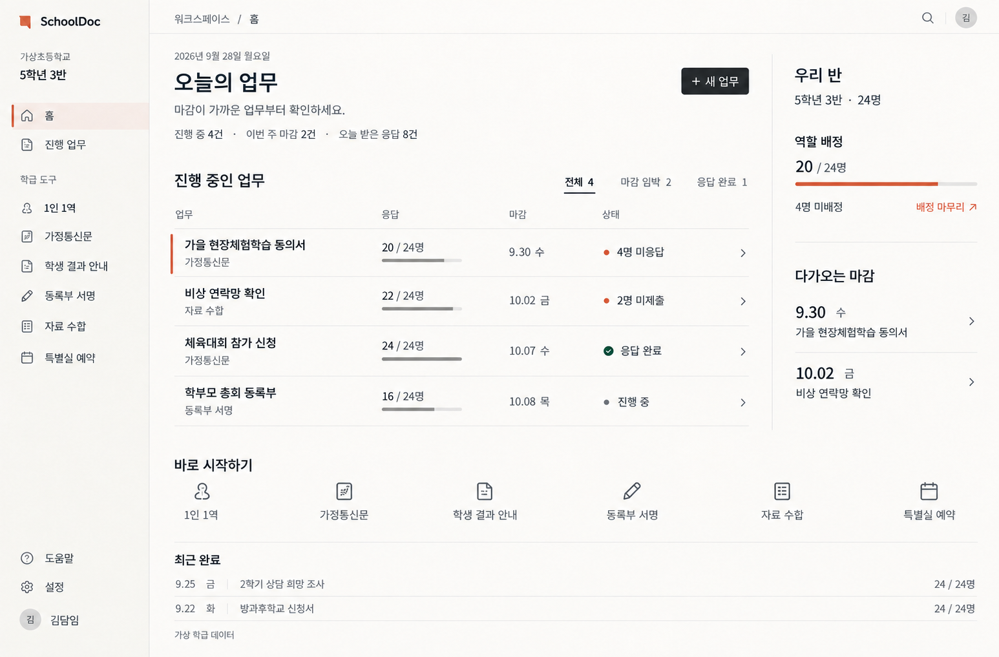
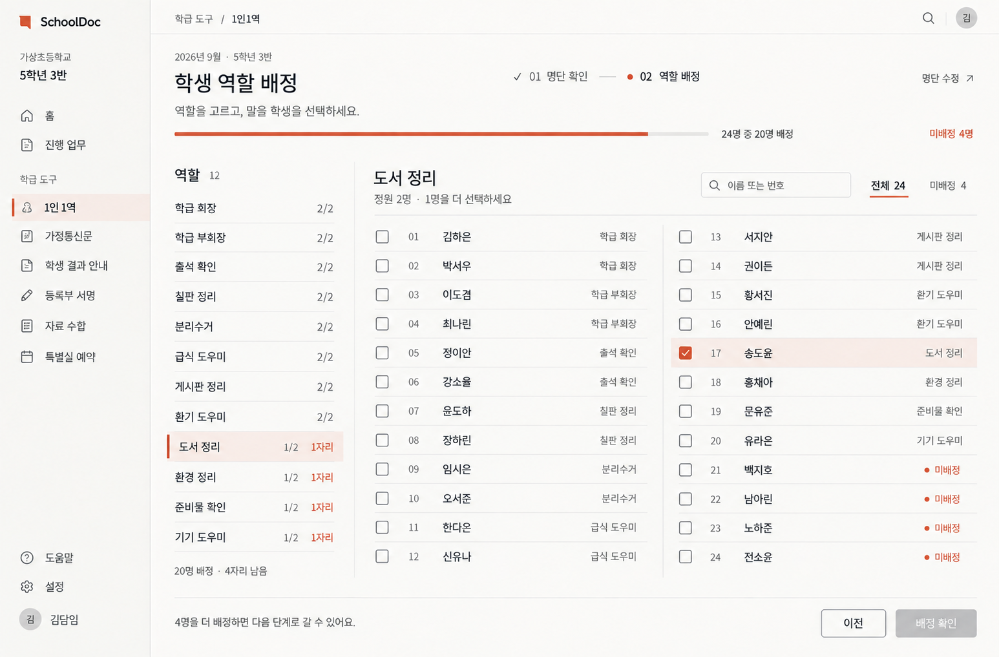
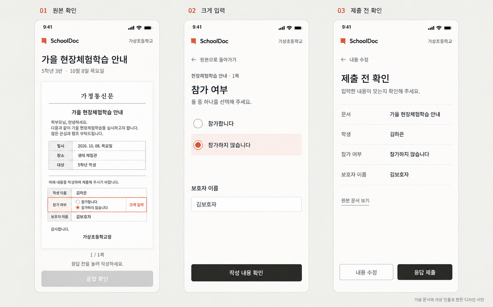

# SchoolDoc 2차 디자인 시안

사용자 피드백을 반영해 첫 시안의 카드·테두리·과한 굵기·파란 강조를 다시 설계했다. 이전 결과는 보존하고 이 폴더에 새 결과를 저장한다.

## 핵심 변화

| 요소 | 이전 시안 | 2차 방향 |
| --- | --- | --- |
| 학생 명단 | 24개 개별 테두리 타일 | 12행씩 나뉜 두 열 명단 |
| 영역 구분 | 중첩 카드와 테두리 | 정렬·여백·가느다란 구분선 |
| 글자 | 굵은 남색 제목과 이름 | 차콜색, 보통·중간 굵기 중심 |
| 강조 | 메뉴·숫자·아이콘·버튼 전반의 파란색 | 선택·미배정에 소량의 주홍색 |
| 홈 | 큰 숫자 요약과 카드 묶음 | 간결한 집계 문장과 업무 목록 |
| 모바일 | 파란 버튼과 박스형 확인 영역 | 차콜 주 행동과 열린 확인 목록 |

색만 바꾼 개편이 되지 않도록 명단 구조와 영역 구획을 먼저 바꿨다. 기존 125개 사이트 조사를 재사용했다. 이번에는 사이트 수를 늘리지 않았다.

## 이미지

### 교사 홈

### 학생 역할 배정

### 학부모 모바일 응답

## 기록

- [125개 사이트 조사와 출처](../2026-09-27/research.md)
- [실제 생성 프롬프트](prompts.md)
- [제작 전 모의 검토](review-before.md)
- [제작 후 모의 검토](review-after.md)

내장 image_gen을 사용했다. 역할 배정은 새 이미지로 생성하고, 그 결과를 홈·모바일의 스타일 참조로 사용했다. 기존 시안에 묶이지 않도록 이전 이미지는 생성 참조로 넣지 않았다. 모든 이름·학교·수량·문서는 가상 예시다.

마무리 편집에서 홈의 하단 열 균형과 명단·모바일의 작은 글씨 명도를 조정했다. 명도 조정 전 중간 결과 두 장은 drafts 폴더에 보존했다. 최종 파일은 이 문서에 연결된 PNG 세 장이다.

파일 검사 결과: 홈·역할 배정 각각 1546×1017, 모바일 보드 1589×989 PNG 디코딩 정상. 로컬 문서 링크 10개 정상. 최종 전체 이미지에서 수량과 선택·부정 응답의 의미를 확인했다.

이미지 시안이며 실제 앱 코드를 수정하거나 배포하지 않았다. 정적 이미지의 구도와 글자를 검토한 결과를 실제 교사 사용성 검증이나 상용 출시 승인으로 표현하지 않는다.
