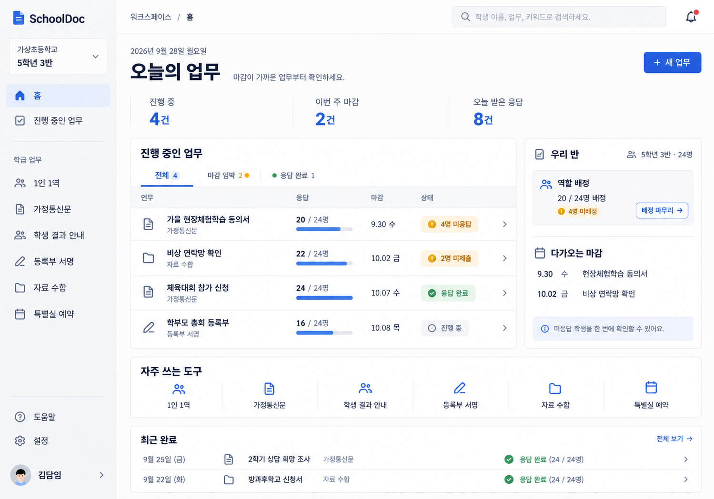
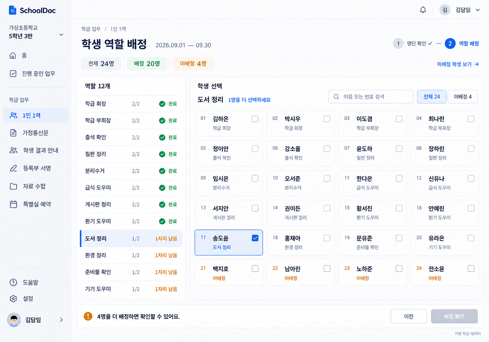
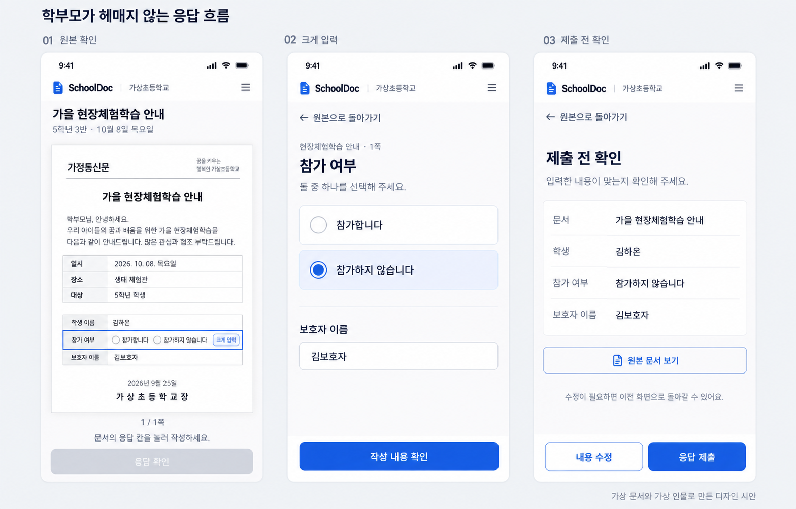

# SchoolDoc 서비스 디자인 시안

2026-09-27 · 125개 사이트 검색 → 핵심 참고 10개 → 같은 디자인 방향의 시안 3장.

**추천 방향: 읽기 쉬운 한글과 목록 중심의 교사 업무 화면.** 밝은 중립색, 선명한 파란 주 행동, 이름이 보이는 탐색, 상태가 명확한 명단을 공통 원칙으로 삼았다. 화면에 쓰인 학교·이름·수치는 가상 데이터다.

## 시안

### 01 교사 홈

도구 소개보다 진행 중인 업무, 미응답 인원, 가까운 마감이 먼저 보인다. 오른쪽 요약에서 학급 역할 배정을 마무리할 수 있다. 큰 소개 카드 대신 실제 업무 목록과 작은 도구 바로가기를 사용한다.

### 02 학생 역할 배정

왼쪽 역할 목록과 오른쪽 학생 명단을 나란히 배치한다. 24명 중 배정 20명, 미배정 4명. 12개 역할 중 8개는 2/2명, 4개는 1/2명으로 수량을 맞췄다. 선택된 도서 정리에는 17번 학생 한 명이 배정돼 있으며, 마지막 네 명은 미배정이다.

### 03 학부모 모바일 응답

원본 한 페이지 전체 확인 → 원본 응답 칸을 크게 입력 → 제출 전 확인의 세 장면이다. '참가하지 않습니다'도 유효한 답으로 취급하며 마지막 버튼은 '응답 제출'이다. 원본 확인·필드 확대·최종 확인을 서로 오갈 수 있는 흐름을 제안한다.

## 근거와 생성 기록

- [125개 사이트 목록과 핵심 참고 10개](research.md)
- [검색 문구·출처 링크 원자료](site-audit.json)
- [실제 사용한 생성·수정 프롬프트](prompts.md)
- [세 전문가 관점의 모의 검토와 구현 조건](review.md)

내장 image_gen으로 신규 이미지 3장을 생성했다. 역할 배정의 최초 결과에서 임의 메뉴가 발견돼 같은 도구의 편집 모드로 수정했다. 외부 API·CLI는 사용하지 않았다. 실제 서비스 코드와 배포는 변경하지 않았다.

## 구현할 때 유지할 기준

| 항목 | 목표 |
| --- | --- |
| 레이아웃 | 데스크톱 좌측 탐색 약 224px, 본문 기본 여백 24–32px, 좁아지면 보조 열부터 아래로 이동 |
| 타이포그래피 | Pretendard 또는 한글 시스템 폰트. 본문 16px 기준, 보조 정보는 13–14px 이상, 제목 28–32px |
| 색 | 본문 #18243A, 보조 #687488, 주 행동 #245DDD, 선택 배경 #EDF3FF, 경계 #E3E7EE |
| 상태 | 색 + 명확한 텍스트 + 체크/선택 표시. 완료된 학생 이름도 흐리게 숨기지 않음 |
| 조작 | 클릭·터치 영역 44×44 CSS px 목표, 키보드와 포커스 상태 별도 구현 |
| 스크롤 | 본문 문서 한 곳이 세로 스크롤 담당. 패널마다 내부 스크롤을 만들지 않음 |
| PDF 응답 | 모든 원본 페이지 표시 성공 후 응답 활성화. 값 보존·원본 복귀·선택 규칙 유지 |

정적인 생성 이미지이므로 위 수치를 실제 CSS처럼 측정·보증하는 산출물은 아니다. 홈의 통합 집계와 새 업무 진입은 기존 기능·데이터에 매핑할 설계 제안이며, 구현 완료를 의미하지 않는다. 정식 구현에서는 현재 기능별 인증·공개 범위·서버 검증을 그대로 유지해야 한다.

