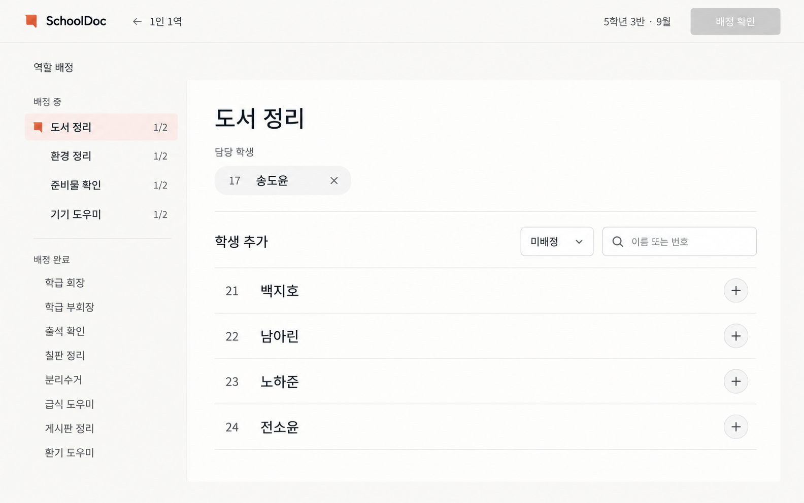

# SchoolDoc 디자인 개선 실행 계획서

작성일: 2026-09-27 · 상태: 사용성 피드백에 따른 PC 배정 화면 재수정·로컬 검증 완료 / 운영 미배포

**후속 결정:** 실제 조작 후 사용자는 3차 시안 구현보다 이전 카드형 화면이 배정하기 편하다고 평가했다. 아래 문서의 3차 시안 확정은 당시의 결정 기록이며 현재의 최종 목표가 아니다. 현 코드의 [복구 지점](checkpoints/2026-09-27-before-card-usability-update/README.md)을 보존하고, 역할·학생을 동시에 보는 카드형 빠른 선택을 되살리되 색·텍스트·위계를 정리했다. 홈과 모바일은 유지했다. [재수정 결과와 실제 화면](implementation-2026-09-27-card-usability/README.md)을 확인할 수 있다.

구현 결과와 화면 캡처: [구현 후 검토](implementation-2026-09-27/README.md)

승인된 PC 역할 배정 시안을 실제 화면에 구현한다. 첫 적용 대상은 학생 역할 배정과 같은 컴포넌트를 쓰는 역할 교체 화면이다. 정보의 중요도, 작업 순서, 불필요한 텍스트 제거를 먼저 맞추고 색·여백·글자·상호작용을 완성한다.

## 1. 확정된 방향과 적용 범위

사용자는 아래 이미지를 확인하고 “이거 마음에 들어”라고 밝혔다. 따라서 **3차 시안을 PC 역할 배정의 기준안으로 확정**한다. 새로운 보드형 배치나 다른 디자인 방향을 다시 만드는 작업은 진행하지 않는다.



| 구분 | 계획 |
| --- | --- |
| PC 역할 배정 | 승인 시안의 왼쪽 역할 탐색 + 오른쪽 담당 학생·추가 후보 구조를 구현한다. |
| PC 역할 교체 | 같은 배정 화면을 사용하므로 함께 적용한다. 이전 역할 확인·다음 기간·과거 배정 보존은 유지한다. |
| 서비스 홈·1인 1역 홈 | 현재 스타일과 구성을 유지한다. 기존 홈 시안이 있다는 이유로 홈을 교체하지 않는다. |
| 모바일 | 사용자가 좋다고 한 방향을 유지한다. 승인된 참여자 모바일 시안과 기존 교사용 모바일 배정 화면은 서로 다른 기준으로 관리한다. |
| 다른 PC 업무 화면 | 후속 후보로만 정리한다. 역할 배정의 두 열 구조를 모든 업무에 일괄 적용하지 않는다. |
| 계획 작성 당시의 산출물 | 실행 가능한 계획서. 후속 구현 요청의 결과는 위 구현 후 검토 문서에서 확인한다. |

기존 [사이트 조사](2026-09-27/research.md), [논문 검토](2026-09-27-v3/paper-review.md), [3차 시안 검토](2026-09-27-v3/review-after.md)를 참고한다. 이전 문서의 ‘미배정 수 상시 표시’, 전체 학생 타일, 새 홈 개편 제안은 이번 사용자 결정과 충돌하는 부분에 한해 적용하지 않는다. 과거 자료 자체는 이력으로 보존한다.

## 2. 현재 구현과 승인 시안의 차이

2026-09-27 로컬 소스와 관련 테스트를 확인했다. 아래는 코드에서 확인한 차이이며, 이번 계획 작성 중 실제 브라우저 화면을 새로 측정한 결과는 아니다.

| 항목 | 현재 코드 | 변경 목표 |
| --- | --- | --- |
| 화면 외곽 | 전역 사이드바, 업무 제목, 단계 표시, 기간 패널, 하단 조작 영역이 함께 존재 | PC 배정 작업에서 간결한 상단 바와 작업 본문으로 정리 |
| 역할 탐색 | 역할별 테두리 카드, 목록 길이에 따른 상하·좌우 자동 전환 | 안정적인 왼쪽 목록. ‘배정 중’과 ‘배정 완료’ 구분 |
| 역할 정원 | 역할 목록과 상세 제목에 반복 | 배정 중 역할 행의 `1/2`처럼 한 위치에서 표시 |
| 현재 담당자 | 전체 학생 카드 안의 체크 상태로 표현 | 역할 제목 바로 아래 담당자 목록과 제거 버튼 |
| 추가 후보 | 기본적으로 전체 학생을 여러 열의 카드로 표시 | 기본은 미배정 학생의 한 열 목록. 번호·이름·추가 행동을 정렬 |
| 학생 상태 | 학생마다 ‘미배정’, ‘이 역할 담당’ 등을 반복 | 기본 후보 목록에서는 반복 상태 문구 제거. 전체 필터에서만 기존 역할 등 필요한 차이를 표시 |
| 배정 진행 | 하단 ‘미배정 N명’ 또는 ‘모두 배정됨’ 표시 | 상시 통계 제거. 상단 ‘배정 확인’의 상태와 역할 탐색으로 작업 진행 |
| 보조 기능 | 정원 변경·기간 변경 등이 기본 화면에 여러 곳 노출 | 관련 위치의 보조 메뉴·펼침으로 접근 가능하게 유지 |
| 스타일 | 파란 배경·테두리·굵은 글자가 여러 영역에 사용됨 | 따뜻한 중립 배경, 차콜 본문, 제한된 선택 강조, 얇은 구분선 |

색 변경만으로 완료 처리하지 않는다. 기본 후보 수, 담당자 분리, 반복 정보 제거, 주 행동 위치가 실제로 달라져야 한다.

## 3. 정보 구조와 표시 규칙

### 상단 바

- SchoolDoc 식별, ‘1인 1역’ 복귀, 학급·배정 기간, ‘배정 확인’을 배치한다.
- 시안의 ‘5학년 3반 · 9월’은 가상 예시다. 실제 저장된 학급명과 기간을 표시하며 월을 넘는 사용자 지정 기간을 ‘9월’로 축약하지 않는다.
- 명단 확인 단계로 돌아가는 경로는 ‘명단 수정’으로 제공한다. 서비스 홈 복귀와 명단 수정의 의미를 구분한다.
- PC 작업 화면에서 전역 탐색을 정리하되 다른 경로와 모바일의 탐색은 유지한다. 상단 배정 확인과 동일한 기본 버튼을 하단에 중복 배치하지 않는다.

### 왼쪽 역할 탐색

- 역할을 ‘배정 중’과 ‘배정 완료’로 묶고, 그룹 안에서는 기존 역할 순서를 유지한다.
- 정원을 채우지 않은 역할은 현재 인원/정원만 표시한다. 정원을 채운 역할은 완료 그룹에서 작은 목록으로 표시하며 계속 선택·수정할 수 있다.
- 선택한 역할은 배경과 형태 또는 표시 기호로 구분하고 접근성 상태도 제공한다. 색 하나에만 의존하지 않는다.
- 선택 중인 역할을 배정·해제하더라도 현재 상세와 포커스는 유지한다. 해당 행의 그룹 이동은 다른 역할 선택 시 정리해 조작 도중 위치가 튀지 않게 한다.
- 역할 추가는 목록 하단의 보조 동작으로 제공한다. 정원 변경은 선택 역할의 보조 메뉴에 둔다.

### 오른쪽 작업 영역

1. 선택 역할 제목.
2. ‘담당 학생’: 번호·이름과 제거 버튼. 담당자가 많으면 자연스럽게 줄바꿈한다.
3. ‘학생 추가’: 미배정/전체 필터와 이름·번호 검색.
4. 후보 학생 행: 번호, 이름, 추가 버튼. 행 전체를 하나의 추가 버튼으로 구현해 작은 `+`만 누르지 않도록 한다.

기본 필터는 ‘미배정’이다. ‘전체’에서는 현재 담당 학생은 선택 상태로, 다른 역할의 학생은 기존 역할명과 함께 보여 준다. 현재 담당자의 해제는 상단 담당 학생 영역에서 수행해 같은 행에 추가와 해제의 의미가 섞이지 않게 한다.

검색과 필터는 후보 표시만 바꾸며 초안 배정을 변경하지 않는다. 역할 변경 시 검색을 초기화하는 기존 동작은 유지하되 필터 선택은 작업 중 유지한다. ‘이전 역할 보기’는 교체 화면의 보조 동작으로 제공한다. 역할 설명은 작성된 내용이 있을 때만 제목 근처에서 펼쳐 볼 수 있게 한다.

### 문구 원칙

| 상황 | 표시 방식 |
| --- | --- |
| 정상적인 배정 중 | ‘미배정 4명’, ‘24명 중 20명 배정’, ‘4명을 더 배정하면…’을 상시 표시하지 않는다. |
| 역할의 잔여 자리 | 왼쪽 `1/2` 외에 ‘1명 더’, ‘남은 자리 1개’를 반복하지 않는다. |
| 추가·제거 결과 | 화면의 담당자와 후보 목록을 갱신한다. 보조기술에는 짧은 일회성 상태 알림을 제공할 수 있다. |
| 실제로 진행을 막는 조건 | 정원 부족, 기간 오류, 저장 실패를 발생 위치에서 한 번 설명하고 복구 행동을 연결한다. |
| 최종 확정 | 기간·역할별 학생을 검토하고, 확정 후 직접 수정할 수 없다는 기존 핵심 안내를 유지한다. |

텍스트를 줄이는 대상은 중복된 정상 상태 설명이다. 오류 해결에 필요한 정보와 확정의 결과는 삭제하지 않는다.

## 4. 상호작용과 데이터 규칙

| 상황 | 동작·완료 기준 |
| --- | --- |
| 미배정 학생 추가 | 확인창 없이 초안에 즉시 반영한다. 한 역할에 여러 학생을 연속 추가할 수 있고 학생마다 별도 저장을 요구하지 않는다. |
| 후보 행이 사라짐 | 다음 사용 가능한 후보로 포커스를 옮긴다. 후보가 없으면 학생 추가 영역으로 이동하며 문서 맨 위로 튀지 않는다. |
| 담당 학생 제거 | 해당 학생의 배정만 해제한다. 미배정 필터 조건에 맞으면 후보로 돌아오며 다른 역할의 배정은 유지한다. |
| 다른 역할의 학생 추가 | 기존 역할 → 새 역할 이동 확인을 제공한다. 취소·Esc는 배정을 보존하고 원래 조작 위치로 포커스를 복귀한다. |
| 정원 충족 | 추가를 막되 담당자 제거·정원 변경은 가능하다. 차단 이유는 해당 조작에 연결해 제공한다. |
| 미배정 학생이 없음 | 짧은 빈 상태와 ‘전체 학생 보기’ 경로를 제공한다. 검색 결과 없음과 구별한다. |
| 학생 또는 역할이 없음 | 명단 입력·역할 추가로 연결한다. 사용할 수 없는 빈 배정 화면만 남기지 않는다. |
| 배정 확인 조건 미충족 | 시안처럼 비활성 상태를 표시한다. 키보드·보조기술에서도 이유를 확인할 수 있게 `aria-disabled`와 이벤트 차단 등 적절한 방식을 검증한다. 상시 설명 배너로 되돌리지 않는다. |
| 저장 중·실패 | 중복 확정을 막고 처리 상태를 표시한다. 실패하면 초안·기간·담당자를 유지한 채 재시도한다. 저장하지 않은 입력을 버리는 복귀·새로고침 경로를 점검한다. |
| 최종 확인·취소 | 확인창에서 기존 기간·역할별 학생을 검토한다. 취소하면 초안을 유지하고 ‘배정 확인’으로 포커스를 복귀한다. |

**모든 학생의 배정 완료와 모든 역할의 정원 충족을 구분한다.** 현재 저장 규칙은 학생마다 하나의 역할을 배정하고 정원을 초과하지 않는 것이다. 학생이 모두 배정됐다면 빈자리가 있는 역할이 남아 있어도 기존 검증 규칙에 따라 확정할 수 있어야 한다. 왼쪽의 ‘배정 중’ 그룹을 비워야 확정할 수 있도록 조건을 바꾸지 않는다.

저장 형식인 학생 ID → 역할 ID 매핑, 서버 검증, 소유자 검사, 암호화, 과거 기간의 명단·역할 스냅샷을 유지한다. 시안 구현을 위해 API나 DB 스키마를 바꿀 필요는 현재 확인되지 않았다.

## 5. 시각 규격과 반응형

아래 수치는 승인 이미지를 실제 CSS로 옮길 때 사용할 시작값이다. 이미지의 모든 픽셀을 고정하거나 실제 검증 없이 최종값으로 선언하지 않는다.

| 요소 | 초기 규격과 검증 기준 |
| --- | --- |
| 작업 배경·본문 | 따뜻한 밝은 배경 `#FBFAF8`, 흰 작업 영역, 차콜 본문 `#252824`를 기본 기준으로 삼는다. |
| 선택 강조 | 옅은 주홍 배경과 작은 표시. 강조 텍스트는 `#B9472F` 수준의 짙은 색을 시작값으로 실제 대비 측정 후 결정한다. |
| 글자 | 기존 Pretendard를 사용한다. 역할 제목 32~40px, 영역 제목 18~20px, 이름 16~18px, 보조 정보 14~16px를 시작값으로 검토한다. |
| 굵기 | 본문 400, 이름·역할 500, 제목·주 행동 600 중심. 모든 제목과 학생 이름을 굵게 처리하지 않는다. |
| PC 두 열 | 1366px 이상에서 역할 탐색 약 240~280px, 나머지를 작업 영역에 배분한다. 외곽 여백 32~48px를 기준으로 실제 가용 폭을 확인한다. |
| 학생 행 | 번호 열 정렬, 이름 가변 폭, 우측 행동 고정. 기본 높이 64~76px를 시작값으로 검토하며 긴 이름은 행 높이를 늘린다. |
| 클릭 대상 | 추가·제거·메뉴·역할 선택 모두 44×44 CSS px 이상을 목표로 한다. |
| 경계·그림자 | 목록 구분선은 얇게, 큰 카드 중첩은 제거. 그림자는 대화상자 등 떠 있는 요소에 제한한다. |
| 테마·큰 글자 | 기존 계정별 테마와 글자 크기 설정을 존중한다. 전역 토큰을 덮어 홈과 다른 도구의 스타일을 바꾸지 않는다. |
| 스크롤 | 문서 하나가 세로 스크롤을 맡는다. 역할 목록과 후보 목록 각각에 스크롤을 만들지 않는다. |

PC 화면의 두 열은 데이터 개수만으로 상하 배치로 전환하지 않는다. 좁은 가용 폭이나 200% 확대에서는 기존 모바일 역할 선택 흐름으로 자연스럽게 전환한다. 전환 폭은 1024px을 시작점으로 768·1024·1366px 실제 렌더링을 보고 확정한다.

24명 예시에서 빈 공간과 열 균형을 확인하되, 인원이 적을 때 화면을 채우기 위한 가짜 정보·고정 높이를 넣지 않는다. 60명·60역할에서는 문서가 길어지는 것을 허용한다. 홈과 참여자 모바일의 색·배치·문서 응답 방식은 별도로 유지한다.

## 6. 구현 순서와 산출물

| 순서 | 작업 | 주요 파일·산출물 | 완료 조건 |
| --- | --- | --- | --- |
| 1. 기준 고정 | 승인 이미지와 같은 가상 학급을 준비하고 현재 PC·모바일·홈 전체 화면을 캡처한다. 예외 상태·보조 기능 위치도 목록화한다. | 가상 데이터, 변경 전 전체 캡처, 상태 명세 | 24명·12역할·20명 배정·4명 후보가 재현되고 비교 조건이 기록됨 |
| 2. PC 정보 구조 | 작업 상단 바, 역할 그룹 목록, 담당자 분리, 기본 미배정 필터를 구현한다. | `RoleAssignmentPage.tsx`, `RoleStudentPicker.tsx` | 승인 이미지의 기본 상태와 중복 문구 제거를 브라우저에서 확인 |
| 3. 화면 외곽과 스타일 | PC 배정 작업에만 적용되는 외곽 구성·토큰을 연결하고 여백·글자·선택·행을 조정한다. | `ClassroomRolesWorkspace.tsx`, 필요한 범위의 `App.tsx`, 배정 전용 스타일 | 홈·모바일을 바꾸지 않고 1366px와 1584px에서 전체 구도가 일치 |
| 4. 동작·예외 완성 | 추가·제거·이동·정원·검색·보조 메뉴·확인·실패 복구와 포커스를 연결한다. 교체 화면도 확인한다. | 기존 초안 로직 재사용, 관련 동작 테스트 | 화면 개편 후에도 배정·확정·취소·재시도 결과가 유지됨 |
| 5. 검증·보정 | 대표/최대 명단, 반응형, 접근성, 테마, 홈·모바일 회귀를 검사한다. 세 프로파일의 구현 후 판단을 기록한다. | 전체 캡처, 테스트 결과, 구현 후 검토서 | 아래 인수 조건 충족, 남은 이슈와 영향 명시 |
| 6. 인계 | 변경 내역·화면 비교·검증 결과·배포 여부를 정리한다. | 구현 완료 보고 | 시안 승인, 로컬 구현 검증, 원격 적용 상태를 구분해 보고 |

단계 2~4는 같은 작업 흐름이므로 서로 맞춰 진행할 수 있다. 단계 5 전에 기본 상태만 꾸민 화면을 완료로 보고하지 않는다. 이 계획에 근거한 운영 배포는 별도 배포 작업으로 다룬다.

### 파일별 작업 경계

| 파일 | 예정 작업·유지 사항 |
| --- | --- |
| [RoleStudentPicker.tsx](../../src/features/classroomRoles/RoleStudentPicker.tsx) | PC 탐색·담당자·후보 구조와 필터 구현. 모바일 표현은 기존 흐름을 보존하고 같은 초안 상태를 사용한다. |
| [RoleAssignmentPage.tsx](../../src/features/classroomRoles/RoleAssignmentPage.tsx) | PC 단계 표시·기간·상단 확인·보조 동작 정리. 명단 확인과 최종 확인의 의미 유지. |
| [ClassroomRolesWorkspace.tsx](../../src/features/classroomRoles/ClassroomRolesWorkspace.tsx) | 배정·교체 작업에서 중복 제목과 폭 제약 정리. 1인 1역 홈·기록·설정에 일괄 적용하지 않는다. |
| [App.tsx](../../src/App.tsx) | 필요할 경우 배정 작업의 PC 외곽 표시만 경로·단계에 맞춰 분기한다. 단계·창 너비 변경으로 배정 컴포넌트가 재마운트되어 초안이 사라지지 않도록 한다. |
| [RoleControls.tsx](../../src/features/classroomRoles/RoleControls.tsx), [index.css](../../src/index.css) | 전역 일괄 교체를 피한다. 배정 영역으로 제한된 변형을 추가하고 기존 토큰·글자 크기 설정과의 충돌 확인. |
| [roleAssignmentDraft.ts](../../src/features/classroomRoles/roleAssignmentDraft.ts) | 배정·해제·정원 검증 재사용. UI 편의 때문에 저장 계약 변경 금지. |
| [classroom-roles.spec.ts](../../tests/e2e/classroom-roles.spec.ts) | PC의 카드·체크박스·통계 문구 의존 검사를 새 행·버튼·필터에 맞춰 갱신. 모바일 기존 흐름과 실제 데이터 결과 검사는 유지. |
| [app-shell-scroll.spec.ts](../../tests/e2e/app-shell-scroll.spec.ts) | 이미 등록된 배정·교체 경로를 활용해 문서 스크롤과 하단 빈 공간 검증. |

서버·DB·공개 학생 화면은 이번 시각 개선의 수정 대상이 아니다. 이 영역의 변경이 실제로 필요해지면 화면 작업과 구분해 이유와 영향을 기록한다.

## 7. 검증과 인수 조건

### 화면과 데이터

| 검증군 | 조건 | 확인 사항 |
| --- | --- | --- |
| 승인 시안 재현 | 24명·12역할, 8역할은 각 2명, 4역할은 각 1명 | 도서 정리 담당 17번 송도윤, 후보 21 백지호·22 남아린·23 노하준·24 전소윤. 수치 관계 일치 |
| 소규모·빈 상태 | 0명·0역할, 3명, 후보 0명, 검색 결과 0명 | 빈 상태 구별, 복구 경로, 불필요한 늘림·장식 없음 |
| 최대·긴 데이터 | 학생 60명, 역할 60개, 정원 1~60명, 40자 이름·역할명, 동명이인 | 잘림·겹침·가로 넘침 없음. 이름과 번호로 대상 구분 |
| 서로 다른 완료 조건 | 모든 학생 배정 / 일부 역할 빈자리, 역할 정원 충족 / 다른 학생 미배정 | 기존 확정 조건·초과 방지 유지 |
| PC | 1366×768, 1584×993, 1920×1080 | 전체 구도·첫 작업 가시성·열 균형·과도한 빈 영역 점검 |
| 중간 폭·모바일 | 1024px, 768px, 390px, 320px | 폭 전환 시 초안 유지, 기존 모바일 탐색 유지, 가로 넘침 없음 |
| 가독성 | 200% 브라우저 확대, 앱의 큰 글자 설정, 기존 사용자 테마 | 행동 접근 가능, 포커스 가림 없음, 배경·텍스트·선택 구분 |
| 회귀 | 서비스 홈, 1인 1역 홈, 교사용 모바일, 참여자 모바일 | 같은 조건의 변경 전후 전체 캡처로 스타일·동작 보존 확인 |

이미지 확대나 CSS `zoom` 검사만으로 실제 브라우저 200% 확대를 검증했다고 보고하지 않는다. 자동 검사와 실제 키보드 조작을 함께 수행한다.

### 실행할 검사

아래는 **후속 구현 단계의 실행 계획**이다. 현재 계획서 작성으로 통과한 결과가 아니다.

```bash
npm run typecheck
npm run lint
npm test -- tests/unit/roleAssignmentDraft.test.ts tests/unit/classroomRoles.test.ts tests/unit/scrollContainersAreDeliberate.test.ts tests/unit/settingsAppearance.test.ts
npm run test:e2e -- tests/e2e/classroom-roles.spec.ts tests/e2e/app-shell-scroll.spec.ts tests/e2e/settings.spec.ts
```

- 공통 셸·공통 로직까지 변경하면 `npm test`로 전체 단위 검사를 수행한다. 번들·설정·의존성 변경 시 `npm run build`를 수행한다.
- 기존 E2E의 ‘미배정 N명’, ‘모두 배정됨’, ‘필터 없음’, 카드 열 수 기대값을 기계적으로 보존하지 않는다. 대신 필터 결과·현재 담당자·저장 결과·정원 제한을 검증한다.
- 사용자 눈에 보이는 정상 상태에서 중복 통계와 설명이 없는지 확인한다. 일회성 보조기술 알림과 실제 오류 문구까지 금지하지 않는다.
- axe 검사와 함께 Tab·Shift+Tab·Enter·Space·Esc, 추가 후 포커스, 이동 취소·확인창 닫기 후 포커스 복귀를 점검한다.
- 클릭 영역, 텍스트·조작 대비를 실제 DOM과 계산된 스타일로 측정한다. 이미지 시안의 인상으로 접근성 통과를 선언하지 않는다.
- Chrome 및 `127.0.0.1:4173` 데모 설정을 확인한다. 기존 서버를 재사용할 때 실제 Supabase 자료를 검사 대상으로 섞지 않는다.
- 원격 연동·배포 확인은 이 디자인 계획 작성에서 실행하지 않는다. 후속 결과도 데모와 원격을 구분한다.

### 완료 체크리스트

- [ ] 기본 PC 화면이 승인 시안의 정보 구조와 시각 위계를 따른다.
- [ ] 현재 담당자를 후보 목록과 분리하고 기본 후보는 미배정 학생이다.
- [ ] 중복 총계·미배정 인원·다음 단계 안내·정원 설명을 제거했다.
- [ ] 전체 학생 접근, 기존 역할 이동, 정원·기간·명단 수정 경로가 유지된다.
- [ ] 여러 학생 연속 추가, 해제, 취소, 저장 실패 복구에서 값과 포커스가 보존된다.
- [ ] 모든 학생 배정과 모든 역할 정원 충족을 혼동하지 않는다.
- [ ] 대표·최대·빈 명단과 긴 이름을 PC·모바일 전체 화면으로 확인했다.
- [ ] 홈·모바일 스타일과 기존 사용자 설정이 유지된다.
- [ ] 필요한 검사와 세 프로파일의 구현 후 검토를 완료하고 미확인 사항을 기록했다.

## 8. 모의 전문가 사전 검토와 남은 위험

[웹디자이너](../../pro/web-designer.md), [UX 디자이너](../../pro/ux-designer.md), [UI 디자이너](../../pro/ui-designer.md) 프로파일을 적용한 AI 검토다. 사용자에게 시안 선호를 확인받은 사실과 실제 전문가·교사 사용성 시험을 구분한다.

| 관점 | 사전 판단 | 근거 | 구현 후 확인할 위험 |
| --- | --- | --- | --- |
| 웹디자인 | 수정 필요 | 승인 시안은 탐색과 주 작업의 위계가 분명하다. 현재 코드는 역할·학생 카드와 여러 외곽 영역의 시각적 무게가 크다. | 60개 역할·담당자 다수·후보 소수일 때 열 불균형. 작은 화면에서 제목과 여백 과대화. |
| UX | 방향 채택 / 실제 사용성 판단 보류 | 담당자와 후보 분리, 기본 미배정 목록은 현재 과제와 연결된다. 검색·전체 필터가 재배정 경로를 유지한다. | 완료 역할 이동, 추가 직후 후보 소멸, 비활성 확인 버튼의 이유 발견, 보조 기능 발견성. |
| UI | 구현 검증 필요 | 승인 이미지는 추가·제거 위치가 명확하지만 키보드·대비·실제 클릭 면적을 입증하지 않는다. | 아이콘의 접근 가능한 이름, 긴 이름 줄바꿈, 사용자 테마 충돌, 초점 복귀와 비활성 상태 전달. |

구현 후에는 각 관점을 `통과 / 수정 필요 / 판단 보류`로 다시 기록하고 전체 캡처·측정·과제 수행 결과를 연결한다. 논문 검토를 실제 SchoolDoc의 업무 시간 단축이나 상용 품질 검증으로 대체하지 않는다.

## 9. 후속 확장 기준

역할 배정 검증 후 재사용할 것은 글자 위계, 목록 정렬, 상태 표현, 오류·복구 패턴이다. 다른 도구의 고유 업무 흐름을 같은 모양으로 강제하지 않는다.

| 후속 후보 | 먼저 확인할 과제 | 유지할 조건 |
| --- | --- | --- |
| 명단 중심 관리 화면 | 학생·참여자 탐색, 미처리 대상 찾기, 행 단위 행동 | 이름·번호 구분, 접근 권한, 대량 명단 가독성 |
| 가정통신문·자료 수합 | 문서 확인, 응답·제출 상태, 재제출·오류 복구 | 원본 PDF와 응답 위치, 모든 페이지 로딩, 기존 동의·비동의 의미 |
| 특별실 예약 | 날짜·시간·예약 가능 여부 탐색 | 일정의 행·열 관계와 기존 예약 규칙 |
| 영수증 장부 | 지출 행 확인, 원본 조회, 장부 반영 | 관리자 미리보기 범위, 교사 확인 후 반영, 기존 저장 정책 |

이 목록은 이번 구현 범위가 아니라 후속 작업 후보이다. 홈과 승인된 모바일을 유지한다는 사용자 결정은 후속 작업에도 적용한다.

## 10. 이번 계획서 작성 기록 (codex)

- 읽은 자료: README, 관련 DEVELOPMENT 원칙, 세 디자이너 프로파일, 승인 시안 전체 이미지, 기존 조사·논문·검토 기록, 배정 화면·초안 로직·공통 셸·관련 테스트·Playwright 설정.
- 현재 변경 사항을 확인했으며 README, 영수증, 가정통신문 등 기존 사용자 변경은 이 작업에 섞지 않는다.
- 검증 결과: 문서의 로컬 링크 16개가 모두 존재하고, 줄 끝 공백과 `git diff --check` 오류가 없었다. 승인된 역할 배정·기존 홈·모바일 이미지의 SHA-256이 작성 전과 일치했다. 앱 코드·이미지 변경이 없어 npm 타입 검사·단위·E2E·빌드는 이번 문서 작업에서 실행하지 않았다.
- `../schooldoc-docs/development-history.md`와 선택 참고 `pro/ux-ui-expert.md`는 이 checkout에 없다. 외부 일지를 작성하거나 해당 파일을 검토했다고 보고하지 않으며, 작성 기록을 여기에 남긴다.
- 구현 후 검토·실제 교사 시험·운영 배포는 아직 수행하지 않았다.
