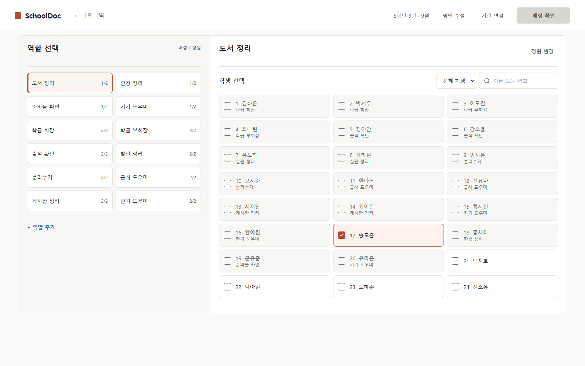

# PC 역할 배정 사용성 재수정 (codex)

2026-09-27 · 로컬 구현, 운영 미배포

후속 정렬·보조 동작 수정의 [AI 모의 전문가 토의와 검증](expert-discussion-alignment.md)을 반영했다. PC 배정 화면에서 역할 설명을 빼고, 명단 수정은 상단으로 이동했다. 두 열의 제목은 같은 글자 크기·굵기·상단 기준과 구분선을 사용한다. 아래 캡처는 이 수정까지 반영한 실제 화면이다.

사용자가 실제 조작 후 이전 카드형 화면이 역할을 배정하기에 더 편하다고 평가했다. 기존 [한 열 후보 화면](../implementation-2026-09-27/role-assignment-desktop.png)은 [복구 지점](../checkpoints/2026-09-27-before-card-usability-update/README.md)에 보존했다. 이번에는 역할과 전체 학생을 동시에 보며 여러 명을 연속 선택하는 방식을 되살리고, 파란·노란 큰 카드와 반복 상태 문구의 시각적 무게를 줄였다. 홈과 모바일은 수정하지 않았다.

## 실제 브라우저 화면

| 조건 | 캡처 |
| --- | --- |
| 가상 학생 24명·역할 12개·20명 배정, 1584px | [기본 PC 전체 화면](role-assignment-desktop.png) |
| 가상 학생 23명·역할 18개, 1024px | [좁은 PC 전체 화면](role-assignment-1024.png) |
| 역할 60개·학생 23명·긴 역할명, 1366px | [대량 역할 전체 화면](role-assignment-60-roles.png) |
| 야간 테마·큰 글자, 1366px | [야간 화면](role-assignment-midnight-large.png) |

모두 Vite 데모 모드의 가상 명단을 실제 Chrome에서 렌더링한 캡처다. 이미지 생성 시안이 아니다.

## 변경 내용

- PC 배정·교체 화면의 왼쪽 역할을 원래의 2열 카드로 복구하고 모든 역할을 기존 순서에 둔다. `배정/정원`은 각 카드에서 한 번만 표시한다.
- 오른쪽은 기본적으로 **전체 학생**을 2~3열로 보여 준다. 학생 카드 전체가 선택 버튼이며, 선택하면 같은 자리에서 체크 상태로 바뀌고 다시 눌러 해제할 수 있다. 다른 역할을 맡은 학생은 해당 역할명만 작게 표시하고, 누르면 기존 이동 확인창을 연다.
- 학생마다 `미배정` 문구를 반복하지 않는다. 전체 배정 통계와 다음 단계 안내도 추가하지 않았다. 미배정 필터와 이름·번호 검색은 필요할 때 사용한다.
- 역할이 40개 이상이고 학생보다 많으면 역할 열을 넓혀 4열 카드로 표시한다. 문서 하나로 세로 스크롤하며 별도 내부 스크롤을 만들지 않았다.
- 선택·완료는 색만이 아니라 `aria-pressed`, 체크 기호, `배정/정원` 수치로 구분한다. 정원 초과 방지, 역할 이동 확인·취소, 배정 검토·확정, 명단·기간·정원 수정은 유지한다.

## 모의 전문가 검토

아래는 [웹디자이너](../../../pro/web-designer.md), [UX 디자이너](../../../pro/ux-designer.md), [UI 디자이너](../../../pro/ui-designer.md) 프로파일에 따른 **AI 모의 검토**다. 사용자의 실제 피드백은 재설계의 출발점이지만, 새 버전에 대한 실제 교사 사용성 시험이나 승인으로 해석하지 않는다.

| 관점 | 구현 전 판단과 근거 | 구현 후 판단과 근거 | 남은 위험 |
| --- | --- | --- | --- |
| 웹디자인 | **수정 필요.** 기존 한 열 후보는 역할·학생 동시 탐색의 정보 밀도가 낮고, 일반 명단에서 한쪽 빈 공간이 컸다. | **조건부 통과.** 24명·23명·60역할 전체 캡처에서 역할 카드와 학생 카드의 정렬·열 균형, 긴 이름 줄바꿈, 제한된 선택 강조를 확인했다. | 극단적으로 많은 역할은 여전히 긴 문서가 된다. 실제 교실 모니터에서의 미적 평가는 남아 있다. |
| UX | **수정 필요.** 학생 네 명만 보이는 필터를 바꿔야 기존 배정을 스캔하고 재배정할 수 있었다. 선택한 학생이 후보 목록에서 사라졌다. | **조건부 통과.** 기본 전체 명단에서 연속 배정·해제, 다른 역할 이동·취소, 정원 제한과 최종 저장을 브라우저 과제로 확인했다. 카드의 위치가 선택 직후 유지된다. | 실제 교사의 반복 작업 시간과 선호는 새 버전에서 직접 확인해야 한다. |
| UI | **수정 필요.** 작은 `+`와 별도 담당자 칩은 한 학생의 선택·해제 위치를 나눴다. | **조건부 통과.** 카드 전체가 62px 이상의 버튼이며 키보드 포커스, `aria-pressed`, 접근 가능한 이름, 야간·큰 글자, axe 검사를 확인했다. | 실제 브라우저 200% 확대와 스크린리더 실기기 조작은 별도로 확인해야 한다. |

## 검증과 범위

- `npm run typecheck`, `npm run lint`, `npm run build`: 통과. 린트의 기존 경고 6건과 빌드의 큰 번들 경고는 남아 있다.
- 관련 단위 테스트 4개 파일·28건 통과.
- 역할 배정, 모바일, 홈, 설정, 문서 스크롤의 Chrome 데모 E2E 40건 통과. 마지막 1024px 열 조정 뒤 관련 5건을 다시 실행해 통과했다.
- 이전 구현과 이번 구현의 390px 모바일 전체 캡처 SHA-256이 일치한다. 홈·공개 참여자 화면은 코드 변경 대상이 아니다.
- 원격 Supabase, 운영 배포, 실제 교사 인터뷰·새 버전 승인까지 확인한 결과는 아니다.

롤백 시에는 복구 지점에 보존된 화면 관련 파일만 현재 경로로 되돌린다. 다른 업무의 미커밋 변경은 보존해야 하며 전체 Git 초기화는 사용하지 않는다.
