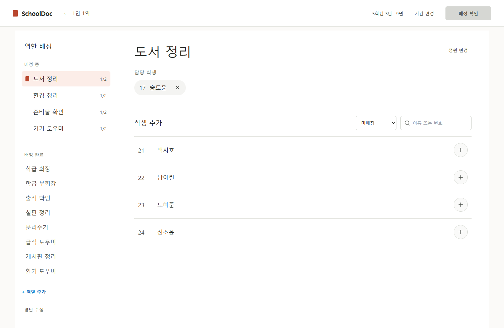

# 승인된 PC 역할 배정 시안 구현 후 검토 (codex)

2026-09-27. 이 문서는 [디자인 개선 계획](../design-improvement-plan.md)의 실행 기록이다. [승인된 이미지 시안](../2026-09-27-v3/01-role-assignment.png)을 기준으로 교사용 PC의 배정·교체 작업을 변경했다. 아래 검토는 [웹디자이너](../../../pro/web-designer.md), [UX 디자이너](../../../pro/ux-designer.md), [UI 디자이너](../../../pro/ui-designer.md) 프로파일을 적용한 **AI 모의 검토**다. 실제 전문가나 교사 인터뷰·사용성 시험 결과가 아니다.

## 실제 화면

| 캡처 | 확인한 조건 |
| --- | --- |
| [PC 배정 전체 화면](role-assignment-desktop.png) | 1584×993, 가상 학생 24명·역할 12개·20명 배정·후보 4명 |
| [교사용 모바일 전체 화면](role-assignment-mobile.png) | 390px, 기존 30명 명단의 배정 흐름 |
| [야간 테마·큰 글자](role-assignment-midnight-large.png) | 1366px, 기존 테마와 글자 크기 설정 |
| [1인 1역 홈](classroom-roles-home.png) | 기존 홈 기능과 구도 유지 |
| [참여자 모바일](participant-mobile.png) | 기존 공개 제출·재제출 흐름 |

모든 명단은 가상이다. 이 캡처는 Vite 데모 환경의 실제 브라우저 렌더링이며 이미지 생성 시안이 아니다. 시안의 네 후보(21 백지호·22 남아린·23 노하준·24 전소윤)와 담당자(17 송도윤)가 같은 순서로 보인다. PC 기본 화면에 전체 배정 통계, 미배정 인원 카운터, 다음 단계 설명은 표시하지 않는다.

## 적용 내용

- 1024px 이상 배정·교체 경로에서 작업 전용 상단 바와 두 열 레이아웃을 사용한다. 전역 사이드바를 작업 중에는 숨기고 1인 1역 복귀 경로를 남겼다. 1024px 미만은 기존 교사용 모바일 선택 흐름을 쓴다.
- 왼쪽에는 ‘배정 중’ 역할과 ‘배정 완료’ 역할을 구분했다. 정원 표시는 배정 중 행에만 둔다. 완료 역할도 선택해 수정할 수 있다. 선택 중인 역할이 정원에 도달해도 조작 중 위치가 튀지 않도록 다음 역할 선택까지 해당 행을 현재 그룹에 둔다.
- 오른쪽에는 역할 제목 → 현재 담당자와 제거 → 학생 추가의 순서로 배치했다. 기본 후보는 미배정 학생만 표시하고, 전체 학생 필터에서 다른 역할 배정과 이동 경로를 제공한다. 검색과 필터는 초안을 바꾸지 않는다.
- 정원 변경·기간 변경·역할 추가·명단 수정·이전 역할 보기를 유지했다. 담당자 해제, 정원 초과 방지, 다른 역할 이동 확인·취소, 최종 검토·확정 및 저장 실패 시 초안 보존은 기존 로직을 사용한다.
- 상단 확인 버튼은 모든 학생이 배정되면 활성화된다. 역할의 빈자리가 남아도 기존 저장 규칙대로 확정 가능하다. 사용 불가 상태의 이유는 버튼에 연결된 접근 가능한 설명으로 제공한다.
- 기본 PC 배정 화면은 따뜻한 밝은 배경과 차콜 글씨를 사용한다. 다른 개인 테마는 기존 설정의 색을 적용하고 큰 글자 설정을 반영한다. 배정 경로 외 홈과 다른 업무에 색 토큰을 전역 적용하지 않는다.

## 모의 전문가 판단

| 관점 | 구현 전 판단 | 구현 후 판단·근거 | 남은 위험 |
| --- | --- | --- | --- |
| 웹디자인 | 수정 필요. 역할 카드·전체 학생 카드·중복 외곽 때문에 PC 주 작업 위계가 약했다. | **조건부 통과.** 승인 시안과 실제 1584px 전체 캡처에서 탐색/상세의 폭과 정렬, 담당자와 후보의 순서, 미완료/완료의 위계를 확인했다. 3명·23명·60명, 60역할의 전체 캡처와 가로 넘침 검사도 통과했다. | 정원과 역할이 모두 많은 특수 학급에서는 세로 길이가 길다. 실제 교실 모니터에서의 미적 선호는 확인하지 않았다. |
| UX | 수정 필요. 학생 전체가 같은 크기의 카드로 먼저 노출됐고 정상 상태를 여러 번 설명했다. | **조건부 통과.** 기본 후보에서 미배정 학생을 추가, 담당자를 해제, 전체 필터에서 다른 역할의 학생을 이동하고 취소·확정했다. 명단 수정 후 초안과 최종 저장 결과를 확인했다. | 보조 기능 발견성, 반복 사용 속도, 다른 역할로 이동할 때의 체감은 실제 교사 과제 시험이 필요하다. |
| UI | 구현 검증 필요. 승인 시안은 실제 포커스·대비·접근 가능한 이름을 보여 주지 않는다. | **조건부 통과.** 44px 이상 행동 영역, 선택 표시와 `aria-pressed`, 후보 추가 뒤 포커스, 이동 취소 후 복귀, 야간 테마·큰 글자, axe 대상 검사를 확인했다. | 실제 브라우저의 200% 확대와 고대비 모드·스크린리더 실기기 조작은 별도로 확인해야 한다. |

## 실행한 검증

- `npm run typecheck`: 통과.
- `npm run lint`: 통과. 이번 변경과 무관한 기존 경고 6건.
- `npm run build`: 통과. 기존 큰 번들 경고는 남아 있다.
- `npm test -- tests/unit/roleAssignmentDraft.test.ts tests/unit/classroomRoles.test.ts tests/unit/scrollContainersAreDeliberate.test.ts tests/unit/settingsAppearance.test.ts`: 4개 파일, 28건 통과.
- `node node_modules/playwright/cli.js test tests/e2e/role-assignment-design.spec.ts tests/e2e/classroom-roles.spec.ts tests/e2e/app-shell-scroll.spec.ts tests/e2e/settings.spec.ts`: 40건 통과. Chrome·`127.0.0.1:4173` 데모 설정에서 실행했다.
- 24명·12역할 시나리오, 0명·0역할, 3명·23명·30명·60명, 역할 60개, 긴 역할명, 1024px·1366px·1584px·390px·320px, 야간 테마와 큰 글자, 문서 스크롤을 확인했다. 기존 E2E의 CSS `zoom=2` 검사는 실제 브라우저 200% 확대와 구분한다.
- 브라우저에서 1인 1역 홈의 내용과 조작이 표시되고 콘솔 오류가 없는 것을 확인했다. 자동 시각·접근성 검사만으로 상용 출시 품질을 입증했다고 주장하지 않는다.

테스트 실행 중 발견한 문제 두 가지를 수정했다. 정원이 채워진 직후 다음 후보가 비활성인데도 그 버튼으로 포커스를 보내던 문제는 학생 추가 제목으로 포커스를 보내도록 바꿨다. 야간 테마에서 마우스를 올린 후보 행이 밝게 바뀌어 글자가 사라지던 문제는 개인 테마의 배경색으로 바꿨다.

## 범위와 확인 한계

앱의 데이터 저장 형식, Supabase 함수·DB, 공개 학생 화면 코드는 변경하지 않았다. 원격 Supabase 연동·운영 배포·실제 교사 시험은 수행하지 않았다. 승인된 홈·참여자 모바일 **이미지 시안 파일 자체**도 수정하지 않았다. `../schooldoc-docs/development-history.md`와 선택 참고 `pro/ux-ui-expert.md`는 이 checkout에 없어 이 문서에 완료 기록을 남긴다.
